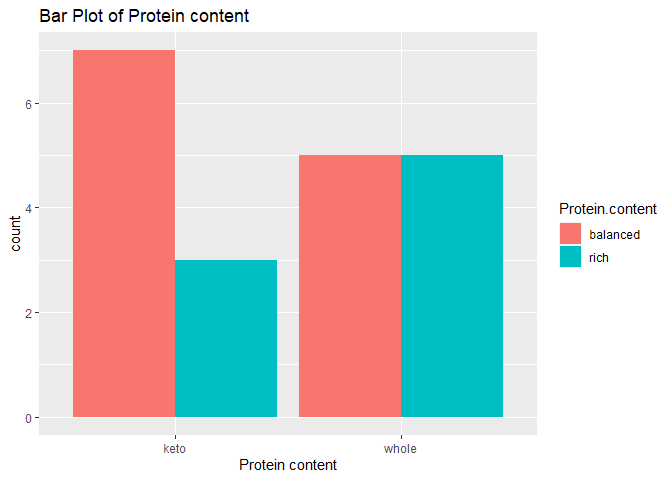
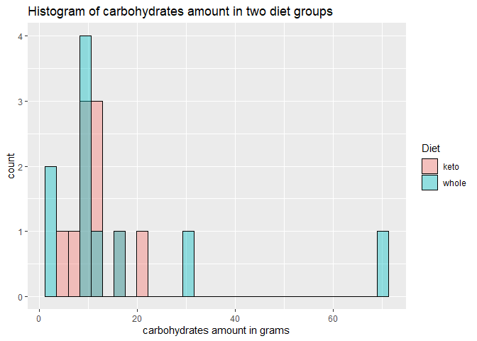
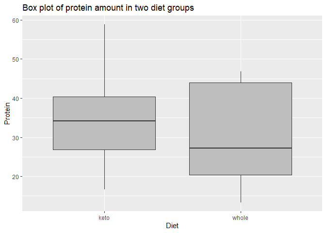
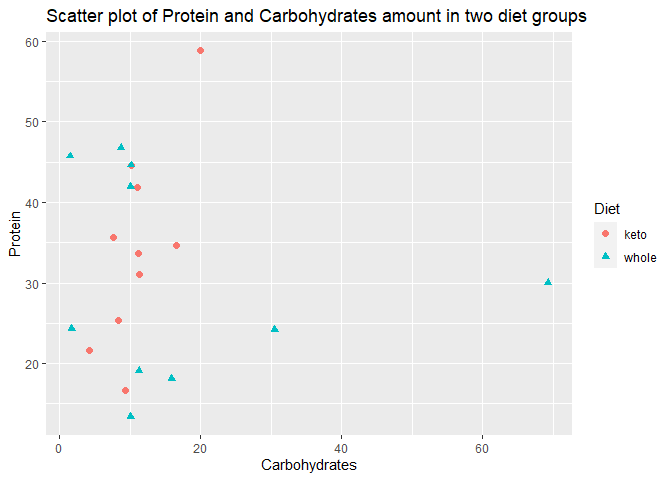

Project2
================
Yuzhi Li, Katelyn Settlemyre
2022-10-03

This vignette explains how to contact an API, demonstrated with the
[Spoonacular Food API](https://spoonacular.com/food-api). We will create
functions to interact with the API and return data.

# Example of R-code that can contact Food data API by searching criteria

First, we’ll show an example of how to contact the API using the complex
recipe search:

``` r
res<-GET("https://api.spoonacular.com/recipes/complexSearch?query=chicken&maxFat=60&number=5&apiKey=be3c2a74ce6c4f0c83b254b34ceca7f5")
dat<-fromJSON(res$url)
as.data.frame(dat)
```

    ##   results.id   results.title                                           results.image results.imageType       nutrients
    ## 1     637876      Chicken 65 https://spoonacular.com/recipeImages/637876-312x231.jpg               jpg Fat, 2.72924, g
    ## 2     716342    Chicken Suya https://spoonacular.com/recipeImages/716342-312x231.jpg               jpg Fat, 34.5817, g
    ## 3     638420   Chicken Wings https://spoonacular.com/recipeImages/638420-312x231.jpg               jpg Fat, 4.85545, g
    ## 4     638174 Chicken Lo Mein https://spoonacular.com/recipeImages/638174-312x231.jpg               jpg Fat, 7.88814, g
    ## 5     638086 Chicken Fingers https://spoonacular.com/recipeImages/638086-312x231.jpg               jpg Fat, 6.29338, g
    ##   offset number totalResults
    ## 1      0      5          577
    ## 2      0      5          577
    ## 3      0      5          577
    ## 4      0      5          577
    ## 5      0      5          577

However, new searches are tedious to type out each time! We will create
functions to interact with the API to retrieve data.

# Package Requirements

Here, we list the packages required to interact with the API and use the
functions defined in this vignette.  
- `httr` - used to access the API  
- `jsonlite` - used to convert the data from the API into a data frame  
- `tidyverse` - used for data manipulation and graphing

# API Interaction Functions

To use some of the interaction functions in this section, you will need
to have a key to access the API. You can register for free
[here](https://spoonacular.com/food-api/console#Dashboard) if you do not
already have a key for this API.

## `recipe.search`

This function allows you to search for recipes given query (i.e., what
are you looking for?), [diet
type](https://spoonacular.com/food-api/docs#Diets), [type of
dish](https://spoonacular.com/food-api/docs#Meal-Types) (such as
breakfast, dessert, side dish, etc.), the maximum number of carbs (in
grams), the minimum amount of protein (in grams), and the maximum amount
of fat (in grams). To give more than one option for a given input, you
will need to give a string of comma separated values.

``` r
recipe.search<- function(key=NULL, query=NULL, diet=NULL, type=NULL, maxCarbs=NULL, minProtein=NULL, maxFat=NULL){
  if(is.null(key)){
    return("your API Key is required.")
  }
  basic.url<-"https://api.spoonacular.com/recipes/complexSearch"
  search.opt<-list(query=query, diet=diet, type=type, maxCarbs=maxCarbs, minProtein=minProtein, maxFat=maxFat, apiKey=key, NULL)
  search.opt2<-search.opt[-which(sapply(search.opt, is.null))]
  #remove spaces from user input
  for(i in 1:length(search.opt2)){
    search.opt2[i]<-str_remove_all(search.opt2[i], " ")
  }
  res<-paste0(basic.url,"?")
  for(i in 1:length(search.opt2)){
    res<-paste0(res,"&", names(search.opt2[i]), "=", search.opt2[i])
  }
  res <- str_remove(res, "&")    #remove the first &, unnecessary

  data<-httr::GET(res)
  mydf<- jsonlite::fromJSON(data$url)
  result<-as.data.frame(mydf)
      return(result)
    }
```

Search recipe example by using the function above:

``` r
recipe.search(key="be3c2a74ce6c4f0c83b254b34ceca7f5", query="chicken", maxFat=60)
```

    ##    results.id     results.title                                           results.image results.imageType
    ## 1      637876        Chicken 65 https://spoonacular.com/recipeImages/637876-312x231.jpg               jpg
    ## 2      716342      Chicken Suya https://spoonacular.com/recipeImages/716342-312x231.jpg               jpg
    ## 3      638420     Chicken Wings https://spoonacular.com/recipeImages/638420-312x231.jpg               jpg
    ## 4      638174   Chicken Lo Mein https://spoonacular.com/recipeImages/638174-312x231.jpg               jpg
    ## 5      638086   Chicken Fingers https://spoonacular.com/recipeImages/638086-312x231.jpg               jpg
    ## 6      638125  Chicken In A Pot https://spoonacular.com/recipeImages/638125-312x231.jpg               jpg
    ## 7      637999  Chicken Burritos https://spoonacular.com/recipeImages/637999-312x231.jpg               jpg
    ## 8      638257  Chicken Porridge https://spoonacular.com/recipeImages/638257-312x231.jpg               jpg
    ## 9      667707  chicken marbella https://spoonacular.com/recipeImages/667707-312x231.jpg               jpg
    ## 10     638148 Chicken Kale Bake https://spoonacular.com/recipeImages/638148-312x231.jpg               jpg
    ##          nutrients offset number totalResults
    ## 1  Fat, 2.72924, g      0     10          577
    ## 2  Fat, 34.5817, g      0     10          577
    ## 3  Fat, 4.85545, g      0     10          577
    ## 4  Fat, 7.88814, g      0     10          577
    ## 5  Fat, 6.29338, g      0     10          577
    ## 6  Fat, 40.5644, g      0     10          577
    ## 7  Fat, 47.1461, g      0     10          577
    ## 8  Fat, 6.47166, g      0     10          577
    ## 9  Fat, 44.8168, g      0     10          577
    ## 10 Fat, 10.3559, g      0     10          577

## `random.recipes`

With this function, you can get between 1 and 100 random recipes. You
may also include tags by giving a string of comma separated values.

``` r
#gives 1-100 random recipes
random.recipes <- function(apiKey=NULL, number=NULL, tags=NULL){
  if(is.null(apiKey)){
    return("Please enter your API key.")
  }
  
  input <- list(apiKey=apiKey, number=number, tags=tags, NULL)   #null list item to use all options
  opts <- input[-which(sapply(input, is.null))]
  #remove spaces from user input
  for(i in 1:length(opts)){
    opts[i]<-str_remove_all(opts[i], " ")
  }
  #cerate URL
  link <- "https://api.spoonacular.com/recipes/random?"
  for(i in 1:length(opts)){
    link<-paste0(link,"&", names(opts[i]), "=", opts[i])
  }
  link <- str_remove(link, "&")    #remove the first &
  
  dat <- httr::GET(link)
  df<- jsonlite::fromJSON(dat$url)
  results <- as.data.frame(df)
  return(results)
}
```

We show an example of this function here.

``` r
random.recipes(apiKey = "31bf40952ec14026b2f82b5055fdab93", number=20, tags = "carrots, potatoes")
```

    ##    recipes.vegetarian recipes.vegan recipes.glutenFree recipes.dairyFree recipes.veryHealthy recipes.cheap
    ## 1               FALSE         FALSE               TRUE              TRUE                TRUE         FALSE
    ## 2               FALSE         FALSE               TRUE              TRUE               FALSE         FALSE
    ## 3               FALSE         FALSE              FALSE              TRUE                TRUE         FALSE
    ## 4                TRUE          TRUE               TRUE              TRUE                TRUE         FALSE
    ## 5               FALSE         FALSE              FALSE              TRUE                TRUE         FALSE
    ## 6               FALSE         FALSE               TRUE              TRUE               FALSE         FALSE
    ## 7               FALSE         FALSE              FALSE              TRUE                TRUE         FALSE
    ## 8               FALSE         FALSE               TRUE              TRUE                TRUE         FALSE
    ## 9               FALSE         FALSE               TRUE              TRUE                TRUE         FALSE
    ## 10              FALSE         FALSE               TRUE             FALSE               FALSE         FALSE
    ##    recipes.veryPopular recipes.sustainable recipes.lowFodmap recipes.weightWatcherSmartPoints recipes.gaps
    ## 1                FALSE               FALSE             FALSE                               45           no
    ## 2                FALSE               FALSE             FALSE                               10           no
    ## 3                FALSE               FALSE             FALSE                               13           no
    ## 4                FALSE               FALSE             FALSE                                6           no
    ## 5                FALSE               FALSE             FALSE                               14           no
    ## 6                FALSE               FALSE             FALSE                                4           no
    ## 7                FALSE               FALSE             FALSE                               27           no
    ## 8                FALSE               FALSE             FALSE                               10           no
    ## 9                FALSE               FALSE             FALSE                                9           no
    ## 10               FALSE               FALSE             FALSE                               24           no
    ##    recipes.preparationMinutes recipes.cookingMinutes recipes.aggregateLikes recipes.healthScore
    ## 1                          -1                     -1                     13                  63
    ## 2                          -1                     -1                     33                  49
    ## 3                          -1                     -1                      6                  63
    ## 4                          -1                     -1                      7                  57
    ## 5                          30                    120                    130                  65
    ## 6                          -1                     -1                     11                  34
    ## 7                          -1                     -1                      6                  78
    ## 8                          10                    480                     57                 100
    ## 9                          -1                     -1                      7                 100
    ## 10                         -1                     -1                     27                  44
    ##                                          recipes.creditsText recipes.license recipes.sourceName recipes.pricePerServing
    ## 1  Foodista.com – The Cooking Encyclopedia Everyone Can Edit       CC BY 3.0           Foodista                  453.88
    ## 2                                               foodista.com            <NA>       foodista.com                  216.66
    ## 3  Foodista.com – The Cooking Encyclopedia Everyone Can Edit       CC BY 3.0           Foodista                  294.05
    ## 4  Foodista.com – The Cooking Encyclopedia Everyone Can Edit       CC BY 3.0           Foodista                  157.28
    ## 5                                               pinkwhen.com            <NA>       pinkwhen.com                  345.26
    ## 6  Foodista.com – The Cooking Encyclopedia Everyone Can Edit       CC BY 3.0           Foodista                  119.65
    ## 7  Foodista.com – The Cooking Encyclopedia Everyone Can Edit       CC BY 3.0           Foodista                  547.92
    ## 8                                               pinkwhen.com            <NA>       pinkwhen.com                  293.64
    ## 9                                               foodista.com            <NA>       foodista.com                  516.03
    ## 10                                              foodista.com            <NA>       foodista.com                  538.94
    ##                                                                                                                                                                                                                                                                                                                                                                                                                                                                                                                                                                                                                                                                                                                                                                                                                                                                                                                                                                                                                                                                                                                                                                                                                                                                                                                                                                                                                                                                                                                                                                                                                                                                                                                                                                                                                                                                                                                                                                                                                                                                                                                                                                                                                                                                                                                                                                                                                                                                                                                                                                                                                                                                                                                                                                                                                                                                                                                                                                                                                                                                                                                                                                                                                                                                                                                                                                                                                                                                                                     recipes.extendedIngredients
    ## 1                                                                                                                                                                                                                                                                                                                                                                                                                                                                                                                                                                                                                                                                                                                                                                                                                                                                                                                                                                                                                                                                                                                                                                                                                                                                                                                                                                                                                                                                                                                                                                         11282, 11124, 11215, 11352, 99231, 6172, 11233, 18139, 1032009, 1102047, Produce, Produce, Produce, Produce, Meat, Canned and Jarred, Produce, Bakery/Bread, Spices and Seasonings, Spices and Seasonings, brown-onion.png, sliced-carrot.png, garlic.png, potatoes-yukon-gold.png, chorizo-sausages.png, chicken-broth.png, kale.jpg, plain-cupcake.jpg, red-pepper-flakes.jpg, salt-and-pepper.jpg, SOLID, SOLID, SOLID, SOLID, SOLID, LIQUID, SOLID, SOLID, SOLID, SOLID, onion, carrots, garlic cloves, potatoes, chorizo links, chicken stock, kale, cup cake, red pepper flakes, salt and pepper, onion, carrot, garlic, potato, chorizo sausages, chicken stock, kale, cupcakes, red pepper flakes, salt and pepper, 1/2 large onion chopped, 3 carrots peeled and sliced, 3 garlic cloves smashed, 4 large yellow potatoes chopped, 2 chorizo links with casings removed, halved and chopped, 4 cups of chicken stock and 2 cups of water, 1 bunch of kale julienned, cup or 6 of water and 2 packets of Chicken Boullion, crushed red pepper flakes, salt and pepper to taste, onion chopped, carrots peeled and sliced, garlic cloves smashed, yellow potatoes chopped, chorizo links with casings removed, halved and chopped, chicken stock and 2 cups of water, kale julienned, or 6 of water and 2 packets of Chicken Boullion, crushed red pepper flakes, salt and pepper to taste, 0.5, 3, 3, 4, 2, 4, 1, 1, 1, 1, large, , , large, , cups, bunch, cup, serving, serving, chopped, peeled, sliced, smashed, yellow, chopped, with casings removed, halved and chopped, julienned, red, crushed, to taste, 0.5, 3, 3, 4, 2, 4, 1, 1, 1, 1, large, , , large, , cups, bunch, cup, serving, serving, larges, , , larges, , cups, bunch, cup, serving, serving, 0.5, 3, 3, 4, 2, 946.352, 1, 236.588, 1, 1, large, , , large, , ml, bunch, ml, serving, serving, larges, , , larges, , milliliters, bunch, milliliters, serving, serving
    ## 2                                                                                                                                                                                                                                                                                                                                                                                                                                                                                                                                                                                                                                                                                                                                                                                                                                                                                                                                                                                                                                                                                                                                                                                                                                                                                                                                           2004, 6008, 1022030, 11124, 2048, 10013346, 11215, 11109, 11282, 11352, 2049, Produce;Spices and Seasonings, Canned and Jarred, Spices and Seasonings, Produce, Oil, Vinegar, Salad Dressing, Meat, Produce, Produce, Produce, Produce, Produce;Spices and Seasonings, bay-leaves.jpg, beef-broth.png, black-pepper.png, sliced-carrot.png, apple-cider-vinegar.jpg, beef-brisket.png, garlic.png, cabbage.jpg, brown-onion.png, potatoes-yukon-gold.png, thyme.jpg, SOLID, LIQUID, SOLID, SOLID, LIQUID, SOLID, SOLID, SOLID, SOLID, SOLID, SOLID, bay leaves, beef broth, black peppercorns, carrots, cider vinegar, corned beef brisket, garlic cloves, green cabbage, onions, potatoes, thyme, bay leaves, beef broth, black peppercorns, carrot, apple cider vinegar, corned beef brisket, garlic, cabbage, onion, potato, thyme, 2 bay leaves, 3 1/2 cups beef broth, 10 black peppercorns, 5 medium carrots, cut into 2-inch pieces (about 2 1/2 cups), 1/4 cup cider vinegar, 1 corned beef brisket (about 3 pounds), 5 garlic cloves, 1 head green cabbage, trimmed and cut into 6 wedges (about 2 pounds), 2 medium onions, cut into quarters, 5 medium potatoes, peeled and cut into quarters (about 5 cups), 2 sprigs of thyme, bay leaves, beef broth, black peppercorns, carrots, cut into 2-inch pieces (about 2 1/2 cups), cider vinegar, corned beef brisket (about, garlic cloves, green cabbage, trimmed and cut into 6 wedges (about 2 pounds), onions, cut into quarters, potatoes, peeled and cut into quarters (about 5 cups), thyme, 2, 3.5, 10, 5, 0.25, 3, 5, 1, 2, 5, 2, , cups, , medium, cup, pounds, , head, medium, medium, sprigs, black, cut into 2-inch pieces ( 2 1/2 cups), green, trimmed, cut into 6 wedges ( 2 pounds), cut into quarters, peeled, cut into quarters ( 5 cups), 2, 3.5, 10, 5, 0.25, 3, 5, 1, 2, 5, 2, , cups, , medium, cups, lb, , head, medium, medium, sprigs, , cups, , mediums, cups, pounds, , head, mediums, mediums, sprigs, 2, 828.058, 10, 5, 59.147, 1.361, 5, 1, 2, 5, 2, , ml, , medium, ml, kgs, , head, medium, medium, sprigs, , milliliters, , mediums, milliliters, kgs, , head, mediums, mediums, sprigs
    ## 3                                                                                                                                                                                                                                                                                                                                                                                                                                                                                                                                                                                                                                                                                                                                                                                                                                                                                                                                                                                                                                                                                                                                                                                                                                                                                                                                                                                                                                                                                                                                                                                                                                                                 10013346, 11124, 11298, 11352, 11215, 93619, 6008, 1012034, 19334, 2004, 99227, Meat, Produce, Produce, Produce, Produce, Alcoholic Beverages, Canned and Jarred, Spices and Seasonings, Baking, Produce;Spices and Seasonings, Condiments, beef-brisket.png, sliced-carrot.png, parsnip.jpg, potatoes-yukon-gold.png, garlic.png, guinness.png, beef-broth.png, seasoning.png, light-brown-sugar.jpg, bay-leaves.jpg, regular-mustard.jpg, SOLID, SOLID, SOLID, SOLID, SOLID, LIQUID, LIQUID, SOLID, SOLID, SOLID, LIQUID, corned beef brisket, carrots, parsnips, potatoes, garlic, guinness, beef broth, Spice Rub, brown sugar, bay leaf, honey mustard, corned beef brisket, carrot, parsnip, potato, garlic, stout, beef broth, dry seasoning rub, golden brown sugar, bay leaves, honey mustard, 2 pounds corned beef brisket, 1 pound carrots, roughly chopped, 1 pound parsnips, roughly chopped, 3 large potatoes, peeled and quartered, 2 cloves garlic, minced, 2 cups Guinness, 2 cups beef broth, 2 tablespoons pickling spice, 1 tablespoon brown sugar, 1 bay leaf, 3 spicy honey mustard, corned beef brisket, carrots, roughly chopped, parsnips, roughly chopped, potatoes, peeled and quartered, garlic, minced, Guinness, beef broth, pickling spice, brown sugar, bay leaf, spicy honey mustard, 2, 1, 1, 3, 2, 2, 2, 2, 1, 1, 3, pounds, pound, pound, large, cloves, cups, cups, tablespoons, tablespoon, , , roughly chopped, roughly chopped, peeled, quartered, minced, 2, 1, 1, 3, 2, 2, 2, 2, 1, 1, 3, lb, lb, lb, large, cloves, cups, cups, Tbsps, Tbsp, , , pounds, pound, pound, larges, cloves, cups, cups, Tbsps, Tbsp, , , 907.185, 453.592, 453.592, 3, 2, 473.176, 473.176, 2, 1, 1, 3, g, g, g, large, cloves, ml, ml, Tbsps, Tbsp, , , grams, grams, grams, larges, cloves, milliliters, milliliters, Tbsps, Tbsp, , 
    ## 4                                                                                                                                                                                                                                                                                                                                                                                                                                                                                                                                                                                                                                                                                                                                                                                                                                                                                                                                                                                                                                                                                                                                                                                                                                                                                                                                                                                                                                                                                                                                                                                                  11352, 11282, 11215, 4584, 11124, 11246, 11143, 16053, 6615, 11297, 1102047, Produce, Produce, Produce, Oil, Vinegar, Salad Dressing, Produce, Produce, Produce, Pasta and Rice;Canned and Jarred, Canned and Jarred, Produce;Spices and Seasonings, Spices and Seasonings, potatoes-yukon-gold.png, brown-onion.png, garlic.png, vegetable-oil.jpg, sliced-carrot.png, leeks.jpg, celery.jpg, broad-beans.jpg, chicken-broth.png, parsley.jpg, salt-and-pepper.jpg, SOLID, SOLID, SOLID, LIQUID, SOLID, SOLID, SOLID, SOLID, LIQUID, SOLID, SOLID, potatoes, onion, garlic, sunflower oil, carrots, leek, celery, broad beans, vegetable stock, parsley, salt and pepper, potato, onion, garlic, sunflower oil, carrot, leek, celery, fava beans, vegetable stock, parsley, salt and pepper, 2 large potatoes, chopped into 1cm cubes, 1 large onion, chopped, 2 cloves garlic, chopped, 2 Tbs sunflower oil, 2 large carrots, peeled and chopped, 1 leek, washed thoroughly, sliced, 2 sticks celery, sliced, 100g broad beans, 1 l vegetable stock, Handful fresh parsley, chopped, Salt and pepper, potatoes, chopped into 1cm cubes, onion, chopped, garlic, chopped, sunflower oil, carrots, peeled and chopped, leek, washed thoroughly, sliced, celery, sliced, broad beans, vegetable stock, fresh parsley, chopped, Salt and pepper, 2, 1, 2, 2, 2, 1, 2, 100, 1, 1, 1, large, large, cloves, Tbs, large, , sticks, g, l, Handful, serving, chopped, chopped, chopped, peeled, chopped, washed, sliced, sliced, fresh, chopped, 2, 1, 2, 2, 2, 1, 2, 3.527, 1.057, 1, 1, large, large, cloves, Tbs, large, , sticks, oz, qt, Handful, serving, larges, large, cloves, Tbs, larges, , sticks, ounces, quarts, Handful, serving, 2, 1, 2, 2, 2, 1, 2, 100, 1, 1, 1, large, large, cloves, Tbs, large, , sticks, g, l, Handful, serving, larges, large, cloves, Tbs, larges, , sticks, grams, liter, Handful, serving
    ## 5  13149, 10120499, 14412, 10011693, 11352, 11124, 11143, 11282, 11168, 10016073, 10016063, 2004, 1022020, 1052047, 6971, 2047, 1002030, 1022027, 6076, 2029, Meat, Pasta and Rice, Beverages, Canned and Jarred, Produce, Produce, Produce, Produce, Produce, Canned and Jarred, Canned and Jarred, Produce;Spices and Seasonings, Spices and Seasonings, Spices and Seasonings, Condiments, Spices and Seasonings, Spices and Seasonings, Spices and Seasonings, Canned and Jarred, Spices and Seasonings, beef-short-ribs.jpg, elbow.jpg, water.png, tomatoes-canned.png, potatoes-yukon-gold.png, sliced-carrot.png, celery.jpg, brown-onion.png, corn.png, white-beans.jpg, black-eyed-peas.jpg, bay-leaves.jpg, garlic-powder.png, garlic-salt.jpg, dark-sauce.jpg, salt.jpg, pepper.jpg, dried-herbs.png, stock-cube.jpg, dried-parsley.png, SOLID, SOLID, LIQUID, SOLID, SOLID, SOLID, SOLID, SOLID, SOLID, SOLID, SOLID, SOLID, SOLID, SOLID, LIQUID, SOLID, SOLID, SOLID, SOLID, SOLID, beef short ribs, elbow macaroni, water 4 qts, canned tomatoes, potatoes, on carrots, celery, onion, kernal corn, butter beans, eyed peas, bay leaves, garlic powder, celery salt, worcestershire sauce, salt, ground pepper, seasoning, beef bouillon cubes, parsley, boneless beef short ribs, elbow macaroni, water, canned tomatoes, potato, carrot, celery, onion, corn, canned butter beans, canned blackeyed peas, bay leaves, garlic powder, celery salt, worcestershire sauce, table salt, black pepper, italian seasoning, beef bouillon cube, dried parsley, 3 lbs of boneless beef short ribs, 1/2 cup uncooked elbow macaroni, 16 cups of water 4 Qts, 1 28oz can diced tomatoes, 1 cup of small diced potatoes, 1 cup on thin sliced carrots, 1 cup thin sliced celery, 1 1/2 cups chopped onion, 1 15oz kernal corn (uncooked), 1 15oz can butter beans, 1 15oz can black – eyed peas, 2 bay leaves, 1 Tbsp garlic powder, 1 tsp celery salt, 1 Tbsp Worcestershire sauce, 1 Tbsp salt, 1 Tbsp fresh ground pepper, 1 Tbsp Italian seasoning, 2 beef bouillon cubes, 2 Tbsp dried parsley or fresh parsley, boneless beef short ribs, uncooked elbow macaroni, water 4 Qts, diced tomatoes, small diced potatoes, on thin sliced carrots, thin sliced celery, chopped onion, kernal corn (uncooked), butter beans, black – eyed peas, bay leaves, garlic powder, celery salt, Worcestershire sauce, salt, fresh ground pepper, Italian seasoning, beef bouillon cubes, dried parsley or fresh parsley, 3, 0.5, 16, 28, 1, 1, 1, 1.5, 15, 15, 15, 2, 1, 1, 1, 1, 1, 1, 2, 2, lbs, cup, cups, oz, cup, cup, cup, cups, oz, oz, oz, , Tbsp, tsp, Tbsp, Tbsp, Tbsp, Tbsp, , Tbsp, boneless, uncooked, diced, canned, diced, sliced, thin, sliced, thin, chopped, uncooked, (), canned, black, canned, fresh, italian, dried, fresh, 3, 0.5, 16, 28, 1, 1, 1, 1.5, 15, 15, 15, 2, 1, 1, 1, 1, 1, 1, 2, 2, lb, cups, cups, oz, cup, cup, cup, cups, oz, oz, oz, , Tbsp, tsp, Tbsp, Tbsp, Tbsp, Tbsp, , Tbsps, pounds, cups, cups, ounces, cup, cup, cup, cups, ounces, ounces, ounces, , Tbsp, teaspoon, Tbsp, Tbsp, Tbsp, Tbsp, , Tbsps, 1.361, 118.294, 3.785, 793.787, 236.588, 236.588, 236.588, 354.882, 425.243, 425.243, 425.243, 2, 1, 1, 1, 1, 1, 1, 2, 2, kgs, ml, l, g, ml, ml, ml, ml, g, g, g, , Tbsp, tsp, Tbsp, Tbsp, Tbsp, Tbsp, , Tbsps, kgs, milliliters, liters, grams, milliliters, milliliters, milliliters, milliliters, grams, grams, grams, , Tbsp, teaspoon, Tbsp, Tbsp, Tbsp, Tbsp, , Tbsps
    ## 6                                                                                                                                                                                                                                                                                                                                                                                                                                                                                                                                                                                                                                                                                                                                                                                                                                                                                                                                                                                                                                                                                                                                                10011355, 98965, 11260, 11124, 11821, 11282, 2045, 11297, 1123, 1012047, 1002030, 1002028, 2049, 4584, Produce, Health Foods, Produce, Produce, Produce, Produce, Produce;Spices and Seasonings, Produce;Spices and Seasonings, Milk, Eggs, Other Dairy, Spices and Seasonings, Spices and Seasonings, Spices and Seasonings, Produce;Spices and Seasonings, Oil, Vinegar, Salad Dressing, red-potatoes.jpg, soy-lecithin.png, mushrooms.png, sliced-carrot.png, red-pepper.jpg, brown-onion.png, dill.jpg, parsley.jpg, egg.png, salt.jpg, pepper.jpg, paprika.jpg, thyme.jpg, vegetable-oil.jpg, SOLID, SOLID, SOLID, SOLID, SOLID, SOLID, SOLID, SOLID, SOLID, SOLID, SOLID, SOLID, SOLID, LIQUID, red skin potatoes, soy lecithin granules, mushrooms, carrot, red bell pepper, onions, dill, parsley, egg, sea salt, ground pepper, sweet paprika, thyme, sunflower oil, red potato, soy lecithin granules, fresh mushrooms, carrot, red pepper, onion, dill, parsley, egg, coarse sea salt, black pepper, sweet paprika, thyme, sunflower oil, 1 kg red skin potatoes, 100g soy granules, 1 kg mushrooms, 1 carrot, 1 red bell pepper, 2 onions, diced, 1 bunch of dill, chopped, 1 bunch of parsley, chopped, 2 eggs ( or egg substitutes for vegans, you can also add 3-4 tbsp dry yeast flakes), sea salt, to taste, 1/2 tsp ground pepper, 1 tsp sweet paprika, 1 tbsp dry thyme, 2 tbsp unrefined sunflower oil, red skin potatoes, soy granules, mushrooms, carrot, red bell pepper, onions, diced, dill, chopped, parsley, chopped, eggs ( or egg substitutes for vegans, you can also add 3-4 tbsp dry yeast flakes), sea salt, to taste, ground pepper, sweet paprika, dry thyme, unrefined sunflower oil, 1, 100, 1, 1, 1, 2, 1, 1, 2, 1, 0.5, 1, 1, 2, kg, g, kg, , , , bunch, bunch, , serving, tsp, tsp, tbsp, tbsp, red, red, diced, chopped, chopped, dry, for vegans, you can also add 3-4 tbsp  yeast flakes), to taste, sweet, dry, 2.205, 3.527, 2.205, 1, 1, 2, 1, 1, 2, 1, 0.5, 1, 1, 2, lb, oz, lb, , , , bunch, bunch, , serving, tsps, tsp, Tbsp, Tbsps, pounds, ounces, pounds, , , , bunch, bunch, , serving, teaspoons, teaspoon, Tbsp, Tbsps, 1, 100, 1, 1, 1, 2, 1, 1, 2, 1, 0.5, 1, 1, 2, kg, g, kg, , , , bunch, bunch, , serving, tsps, tsp, Tbsp, Tbsps, kg, grams, kg, , , , bunch, bunch, , serving, teaspoons, teaspoon, Tbsp, Tbsps
    ## 7                                                                                                                                                                                                                                                                                                                                                                                                                                                                                                                                                                                                                                                                                                                                                                                                                                                                                                                          2004, 1022030, 11109, 11124, 2048, 13346, 1002046, 11215, 14006, 19334, 10511282, 11352, 14412, Produce;Spices and Seasonings, Spices and Seasonings, Produce, Produce, Oil, Vinegar, Salad Dressing, Meat, Condiments, Produce, Alcoholic Beverages, Baking, Produce, Produce, Beverages, bay-leaves.jpg, black-pepper.png, cabbage.jpg, sliced-carrot.png, apple-cider-vinegar.jpg, corned-beef.png, dijon-mustard.jpg, garlic.png, beer.jpg, light-brown-sugar.jpg, brown-onion.png, potatoes-yukon-gold.png, water.png, SOLID, SOLID, SOLID, SOLID, LIQUID, SOLID, LIQUID, SOLID, LIQUID, SOLID, SOLID, SOLID, LIQUID, bay leaves, black peppercorns, cabbage, carrots, cider vinegar, corned beef, dijon mustard, garlic, light beer, light brown sugar, yellow onions, potatoes, water, bay leaves, black peppercorns, cabbage, carrot, apple cider vinegar, corned beef, creole mustard, garlic, light beer, golden brown sugar, yellow onion, potato, water, 4 Bay leaves, 2 dozen whole black peppercorns, 1 small head cabbage, trimmed and quartered (I prefer Napa cabbage!), 4 mediums carrots, peeled, 1 tablespoon cider vinegar, 2.5 pounds corned beef ribs, 2 tablespoons Dijon mustard, 2 large cloves garlic, thinly sliced, 1/4 cup light beer, 1/2 cup light brown sugar, 2 mediums yellow onions, peeled and halved with root end intact, 4 mediums firm potatoes, peeled and halved, 2 quarts hot water, Bay leaves, whole black peppercorns, cabbage, trimmed and quartered (I prefer Napa cabbage!), s carrots, peeled, cider vinegar, corned beef ribs, Dijon mustard, garlic, thinly sliced, light beer, light brown sugar, s yellow onions, peeled and halved with root end intact, s firm potatoes, peeled and halved, hot water, 4, 24, 1, 4, 1, 2.5, 2, 2, 0.25, 0.5, 2, 4, 2, , , small head, medium, tablespoon, pounds, tablespoons, large cloves, cup, cup, medium, medium, quarts, whole, black, trimmed, quartered, (I prefer Napa cabbage!), peeled, thinly sliced, light, light, yellow, with root end intact, peeled, halved, firm, peeled, halved, hot, 4, 24, 1, 4, 1, 2.5, 2, 2, 0.25, 0.5, 2, 4, 2, , , small head, medium, Tbsp, lb, Tbsps, large cloves, cups, cups, medium, medium, qts, , , small head, mediums, Tbsp, pounds, Tbsps, large cloves, cups, cups, mediums, mediums, quarts, 4, 24, 1, 4, 1, 1.134, 2, 2, 59.147, 118.294, 2, 4, 1.893, , , small head, medium, Tbsp, kgs, Tbsps, large cloves, ml, ml, medium, medium, l, , , small head, mediums, Tbsp, kgs, Tbsps, large cloves, milliliters, milliliters, mediums, mediums, liters
    ## 8                                                                                                                                                                                                                                                                                                                                                                                                                                                                                                                                                                                                                                                                                                                                                                                                                                                                                                                                                                                                                                                                                                                                                                                                                                                                                                                                                                                                                                                                                                                                                                                                                                                                                                                                                                                                                                                                                                    6008, 11124, 11143, 6147, 11291, 11352, 11282, 1042027, 10023618, 14412, Canned and Jarred, Produce, Produce, Canned and Jarred, Produce, Produce, Produce, NA, Meat, Beverages, beef-broth.png, sliced-carrot.png, celery.jpg, cream-of-mushroom-soup.png, spring-onions.jpg, potatoes-yukon-gold.png, brown-onion.png, seasoning.png, beef-cubes-raw.png, water.png, LIQUID, SOLID, SOLID, LIQUID, SOLID, SOLID, SOLID, SOLID, SOLID, LIQUID, canned beef broth, carrots, celery, cream of mushroom soup, green onions, new potatoes, onion, seasoning, stew meat, water, beef broth, carrot, celery, condensed cream of mushroom soup, spring onions, potato, onion, seasoning, beef cubes, water, 1 14.5oz can of Beef Broth, 2 large carrots, chopped, 2 stalks celery, chopped, 1 26oz can Cream of Mushroom Soup, 3 green onions, chopped, 10 new (red)potatoes, 1 small onion chopped, ½ cup Dale's Seasoning, 2 pounds stew meat, 2 cups water, Beef Broth, carrots, chopped, celery, chopped, Cream of Mushroom Soup, green onions, chopped, new (red)potatoes, onion chopped, Dale's Seasoning, stew meat, water, 14.5, 2, 2, 26, 3, 10, 1, 0.5, 2, 2, oz, large, stalks, oz, , , small, cup, pounds, cups, canned, chopped, chopped, canned, chopped, red, (), chopped, 14.5, 2, 2, 26, 3, 10, 1, 0.5, 2, 2, oz, large, stalks, oz, , , small, cups, lb, cups, ounces, larges, stalks, ounces, , , small, cups, pounds, cups, 411.068, 2, 2, 737.088, 3, 10, 1, 118.294, 907.185, 473.176, g, large, stalks, g, , , small, ml, g, ml, grams, larges, stalks, grams, , , small, milliliters, grams, milliliters
    ## 9                                                                                                                                                                                                                                                                                                                                                                                                                                                                                                                                                                                                                                                                                                                                                                                                                                                                                                                                                                                                                                                                                                                                                                                                                                                                                                                                                                                                                                                                                                                                                                                                                                                                                                                                                                                                                                                                                                                                                                                                                                                         11352, 11298, 11124, 11282, 10311529, 15076, 4053, 9152, 2047, 2049, Produce, Produce, Produce, Produce, Produce, Seafood, Oil, Vinegar, Salad Dressing, Produce, Spices and Seasonings, Produce;Spices and Seasonings, potatoes-yukon-gold.png, parsnip.jpg, sliced-carrot.png, brown-onion.png, cherry-tomatoes.png, salmon.png, olive-oil.jpg, lemon-juice.jpg, salt.jpg, thyme.jpg, SOLID, SOLID, SOLID, SOLID, SOLID, SOLID, LIQUID, LIQUID, SOLID, SOLID, potato, parsnip, carrot, onion, cherry tomatoes, salmon, olive oil, lemon juice, salt, thyme, potato, parsnip, carrot, onion, cherry tomato, salmon, olive oil, lemon juice, table salt, thyme, 1 potato, 1 parsnip, 1 carrot, 1 onion, sliced, 150 g cherry tomatoes, 2 salmon fillets, 1 tbsp olive oil, 1 tsp lemon juice, Salt, pepper and paprika for seasoning, 2 tsp of fresh rosemary and thyme, chopped, potato, parsnip, carrot, onion, sliced, cherry tomatoes, salmon fillets, olive oil, lemon juice, Salt, pepper and paprika for seasoning, fresh rosemary and thyme, chopped, 1, 1, 1, 1, 150, 2, 1, 1, 1, 2, , , , , g, fillet, tbsp, tsp, serving, tsp, sliced, for seasoning, fresh, chopped, 1, 1, 1, 1, 5.291, 2, 1, 1, 1, 2, , , , , oz, fillet, Tbsp, tsp, serving, tsps, , , , , ounces, fillets, Tbsp, teaspoon, serving, teaspoons, 1, 1, 1, 1, 150, 2, 1, 1, 1, 2, , , , , g, fillet, Tbsp, tsp, serving, tsps, , , , , grams, fillets, Tbsp, teaspoon, serving, teaspoons
    ## 10                                                                                                                                                                                                                                                                                                                                                                                                                                                                                                                                                                                                                                                                                                                                                                                  2004, 1001, 11109, 11124, 2048, 10013346, 20027, 1002024, 1125, 11297, 1002055, 11352, 11282, 1002030, 2047, 19335, 14412, Produce;Spices and Seasonings, Milk, Eggs, Other Dairy, Produce, Produce, Oil, Vinegar, Salad Dressing, Meat, Baking, Spices and Seasonings, Milk, Eggs, Other Dairy, Produce;Spices and Seasonings, Produce, Produce, Produce, Spices and Seasonings, Spices and Seasonings, Baking, Beverages, bay-leaves.jpg, butter-sliced.jpg, cabbage.jpg, sliced-carrot.png, apple-cider-vinegar.jpg, beef-brisket.png, white-powder.jpg, dry-mustard.jpg, egg-yolk.jpg, parsley.jpg, horseradish.jpg, potatoes-yukon-gold.png, brown-onion.png, pepper.jpg, salt.jpg, sugar-in-bowl.png, water.png, SOLID, SOLID, SOLID, SOLID, LIQUID, SOLID, SOLID, SOLID, SOLID, SOLID, LIQUID, SOLID, SOLID, SOLID, SOLID, SOLID, LIQUID, bay leaf, butter, cabbage, carrot, cider vinegar, corned beef brisket, cornstarch, dry mustard, egg yolks, fresh parsley, horseradish, new potatoes, onions, pepper, salt, sugar, water, bay leaves, butter, cabbage, carrot, apple cider vinegar, corned beef brisket, corn starch, mustard powder, egg yolk, parsley, horseradish, potato, onion, black pepper, table salt, sugar, water, 1 bay leaf, 1 tbsp. butter, melted, 1 (2 lb.) cabbage, cut into wedges, 1 large carrot, scraped and sliced, 1/4 c. cider vinegar (good quality), 1 (4 lb.) corned beef brisket, 1 tbsp. cornstarch, 1 tsp. dry mustard, 2 egg yolks, beaten, 1 bunch fresh parsley, 1 tsp. horseradish, 2 lbs. new potatoes, peeled, 3 medium onions, 1/4 teaspoon pepper, 1/2 tsp. salt, 2 tsp. sugar, 1 c. water, bay leaf, butter, melted, cabbage, cut into wedges, carrot, scraped and sliced, cider vinegar (good quality), corned beef brisket, cornstarch, dry mustard, egg yolks, beaten, fresh parsley, horseradish, new potatoes, peeled, onions, pepper, salt, sugar, water, 1, 1, 2, 1, 0.25, 4, 1, 1, 2, 1, 1, 2, 3, 0.25, 0.5, 2, 1, , tbsp, lb, large, c, lb, tbsp, tsp, , bunch, tsp, lbs, medium, teaspoon, tsp, tsp, c, melted, cut into wedges, sliced, (), dry, beaten, fresh, peeled, 1, 1, 2, 1, 0.25, 4, 1, 1, 2, 1, 1, 2, 3, 0.25, 0.5, 2, 1, , Tbsp, lb, large, cups, lb, Tbsp, tsp, , bunch, tsp, lb, medium, tsps, tsps, tsps, cup, , Tbsp, pounds, large, cups, pounds, Tbsp, teaspoon, , bunch, teaspoon, pounds, mediums, teaspoons, teaspoons, teaspoons, cup, 1, 1, 907.185, 1, 59.147, 1.814, 1, 1, 2, 1, 1, 907.185, 3, 0.25, 0.5, 2, 236.588, , Tbsp, g, large, ml, kgs, Tbsp, tsp, , bunch, tsp, g, medium, tsps, tsps, tsps, ml, , Tbsp, grams, large, milliliters, kgs, Tbsp, teaspoon, , bunch, teaspoon, grams, mediums, teaspoons, teaspoons, teaspoons, milliliters
    ##    recipes.id                                       recipes.title recipes.readyInMinutes recipes.servings
    ## 1      636787                  Caldo Verde - Portuguese Kale Soup                     45                4
    ## 2      660266                 Slow Cooked Corned Beef and Cabbage                    500               10
    ## 3      646034            Guinness Braised Corned Beef and Cabbage                     45                6
    ## 4      652332                                      Monastery soup                     45                4
    ## 5      715447                            Easy Vegetable Beef Soup                    150                8
    ## 6      664680                  Vegetarian Mushroom Shepherd's Pie                     45               12
    ## 7      640141 Corned Beef Ribs With Brown Sugar and Mustard Glaze                     45                4
    ## 8      715446                               Slow Cooker Beef Stew                    490                6
    ## 9      659135                      Salmon with roasted vegetables                     45                2
    ## 10     640136    Corned Beef And Cabbage With Irish Mustard Sauce                    270                6
    ##                                                                                 recipes.sourceUrl
    ## 1                       https://www.foodista.com/recipe/7SDK7CGK/caldo-verde-portuguese-kale-soup
    ## 2                     http://www.foodista.com/recipe/K8HQB7RM/slow-cooked-corned-beef-and-cabbage
    ## 3               https://www.foodista.com/recipe/5NNYR6RD/guinness-braised-corned-beef-and-cabbage
    ## 4                                         https://www.foodista.com/recipe/Y67R5WMP/monastery-soup
    ## 5                                            https://www.pinkwhen.com/vegetable-beef-stew-recipe/
    ## 6  https://www.foodista.com/recipe/Q8LZSX4D/vegetarian-mushroom-shepherd-s-pie-with-vegan-version
    ## 7     http://www.foodista.com/recipe/N42YS3BX/corned-beef-ribs-with-brown-sugar-and-mustard-glaze
    ## 8                                           http://www.pinkwhen.com/slow-cooker-beef-stew-recipe/
    ## 9                         https://www.foodista.com/recipe/7TTSVX56/salmon-with-roasted-vegetables
    ## 10             http://www.foodista.com/recipe/B8Z4H57G/corned-beef-and-cabbage-with-mustard-sauce
    ##                                              recipes.image recipes.imageType
    ## 1  https://spoonacular.com/recipeImages/636787-556x370.jpg               jpg
    ## 2  https://spoonacular.com/recipeImages/660266-556x370.jpg               jpg
    ## 3  https://spoonacular.com/recipeImages/646034-556x370.jpg               jpg
    ## 4  https://spoonacular.com/recipeImages/652332-556x370.jpg               jpg
    ## 5  https://spoonacular.com/recipeImages/715447-556x370.jpg               jpg
    ## 6  https://spoonacular.com/recipeImages/664680-556x370.jpg               jpg
    ## 7  https://spoonacular.com/recipeImages/640141-556x370.jpg               jpg
    ## 8  https://spoonacular.com/recipeImages/715446-556x370.jpg               jpg
    ## 9  https://spoonacular.com/recipeImages/659135-556x370.jpg               jpg
    ## 10 https://spoonacular.com/recipeImages/640136-556x370.jpg               jpg
    ##                                                                                                                                                                                                                                                                                                                                                                                                                                                                                                                                                                                                                                                                                                                                                                                                                                                                                                                                                                                                                                                                                                                                                                                                                                                                                                                                                                                                                                                                    recipes.summary
    ## 1                                                                                                                                                                   Caldo Verde - Portuguese Kale Soup is a main course that serves 4. One portion of this dish contains roughly <b>34g of protein</b>, <b>37g of fat</b>, and a total of <b>1215 calories</b>. For <b>$4.54 per serving</b>, this recipe <b>covers 51%</b> of your daily requirements of vitamins and minerals. Head to the store and pick up onion, garlic cloves, pepper flakes, and a few other things to make it today. It is perfect for <b>Autumn</b>. 13 people were glad they tried this recipe. It is brought to you by Foodista. From preparation to the plate, this recipe takes around <b>around 45 minutes</b>. It is a good option if you're following a <b>gluten free, dairy free, and whole 30</b> diet. All things considered, we decided this recipe <b>deserves a spoonacular score of 92%</b>. This score is awesome. If you like this recipe, you might also like recipes such as <a href="https://spoonacular.com/recipes/portuguese-kale-soup-caldo-verde-499535">Portuguese Kale Soup (Caldo Verde)</a>, <a href="https://spoonacular.com/recipes/caldo-verde-portuguese-kale-soup-598606">Caldo Verde | Portuguese Kale Soup</a>, and <a href="https://spoonacular.com/recipes/caldo-verde-portuguese-kale-and-sausage-soup-985620">Caldo Verde (Portuguese Kale and Sausage Soup)</a>.
    ## 2                                                                                                                                  Slow Cooked Corned Beef and Cabbage could be just the <b>gluten free and dairy free</b> recipe you've been looking for. This recipe makes 10 servings with <b>385 calories</b>, <b>25g of protein</b>, and <b>21g of fat</b> each. For <b>$2.17 per serving</b>, this recipe <b>covers 32%</b> of your daily requirements of vitamins and minerals. A mixture of bay leaves, onions, potatoes, and a handful of other ingredients are all it takes to make this recipe so scrumptious. A few people made this recipe, and 33 would say it hit the spot. It works well as a budget friendly main course. From preparation to the plate, this recipe takes approximately <b>8 hours and 20 minutes</b>. It will be a hit at your <b>st. patrick day</b> event. This recipe is typical of European cuisine. It is brought to you by Foodista. Taking all factors into account, this recipe <b>earns a spoonacular score of 99%</b>, which is excellent. <a href="https://spoonacular.com/recipes/slow-cooked-corned-beef-and-cabbage-93151">Slow Cooked Corned Beef and Cabbage</a>, <a href="https://spoonacular.com/recipes/slow-cooked-corned-beef-378244">Slow-Cooked Corned Beef</a>, and <a href="https://spoonacular.com/recipes/slow-cooked-corned-beef-dinner-165331">Slow-Cooked Corned Beef Dinner</a> are very similar to this recipe.
    ## 3                                                                                                                                                                                                                                                                                                    Guinness Braised Corned Beef and Cabbage requires approximately <b>approximately 45 minutes</b> from start to finish. This recipe serves 6. This main course has <b>541 calories</b>, <b>30g of protein</b>, and <b>23g of fat</b> per serving. For <b>$2.94 per serving</b>, this recipe <b>covers 39%</b> of your daily requirements of vitamins and minerals. 6 people have tried and liked this recipe. It can be enjoyed any time, but it is especially good for <b>st. patrick day</b>. This recipe from Foodista requires corned beef brisket, carrots, garlic, and brown sugar. This recipe is typical of European cuisine. It is a good option if you're following a <b>dairy free</b> diet. With a spoonacular <b>score of 89%</b>, this dish is great. <a href="https://spoonacular.com/recipes/guinness-corned-beef-and-cabbage-555600">Guinness Corned Beef and Cabbage</a>, <a href="https://spoonacular.com/recipes/guinness-corned-beef-and-cabbage-431963">Guinness Corned Beef and Cabbage</a>, and <a href="https://spoonacular.com/recipes/guinness-corned-beef-and-cabbage-527562">guinness corned beef and cabbage</a> are very similar to this recipe.
    ## 4                                                                                   If you have approximately <b>approximately 45 minutes</b> to spend in the kitchen, Monastery soup might be an awesome <b>gluten free, dairy free, lacto ovo vegetarian, and vegan</b> recipe to try. For <b>$1.57 per serving</b>, you get a soup that serves 4. One serving contains <b>258 calories</b>, <b>8g of protein</b>, and <b>8g of fat</b>. It can be enjoyed any time, but it is especially good for <b>Autumn</b>. It is brought to you by Foodista. A mixture of potatoes, leek, salt and pepper, and a handful of other ingredients are all it takes to make this recipe so tasty. This recipe is liked by 7 foodies and cooks. Overall, this recipe earns an <b>excellent spoonacular score of 89%</b>. If you like this recipe, take a look at these similar recipes: <a href="https://spoonacular.com/recipes/jamaican-soup-beef-and-pumpkin-flavor-this-soup-be-adventurous-and-try-soup-from-the-carribean-600076">Jamaican soup – beef and pumpkin flavor this soup. Be adventurous and try soup from the carribean</a>, <a href="https://spoonacular.com/recipes/a-quick-and-easy-soup-miso-soup-with-soba-noodles-or-mung-bean-31003">A Quick And Easy Soup {miso Soup With Soba Noodles Or Mung Bean</a>, and <a href="https://spoonacular.com/recipes/puerto-rican-chuletn-soup-aka-xmas-ham-bone-soup-574360">Puerto Rican Chuletón Soup AKA Xmas Ham Bone Soup</a>.
    ## 5                                                                                                                                                                                                                                                                                                                                                                                         Easy Vegetable Beef Soup might be just the main course you are searching for. One portion of this dish contains roughly <b>45g of protein</b>, <b>19g of fat</b>, and a total of <b>566 calories</b>. This dairy free recipe serves 8 and costs <b>$3.45 per serving</b>. Many people made this recipe, and 130 would say it hit the spot. It is brought to you by Pink When. It can be enjoyed any time, but it is especially good for <b>Autumn</b>. If you have butter beans, canned tomatoes, worcestershire sauce, and a few other ingredients on hand, you can make it. From preparation to the plate, this recipe takes about <b>2 hours and 30 minutes</b>. With a spoonacular <b>score of 0%</b>, this dish is improvable. Try <a href="https://spoonacular.com/recipes/easy-vegetable-beef-soup-1050610">Easy Vegetable Beef Soup</a>, <a href="https://spoonacular.com/recipes/easy-vegetable-beef-soup-177116">Easy Vegetable-Beef Soup</a>, and <a href="https://spoonacular.com/recipes/easy-vegetable-beef-soup-459390">Easy Vegetable Beef Soup</a> for similar recipes.
    ## 6                                                                                                                                                                                                                                                                                                                                  Vegetarian Mushroom Shepherd's Pie could be just the <b>gluten free and dairy free</b> recipe you've been looking for. This recipe serves 12 and costs $1.2 per serving. One serving contains <b>124 calories</b>, <b>6g of protein</b>, and <b>6g of fat</b>. If you have bell pepper, soy granules, thyme, and a few other ingredients on hand, you can make it. This recipe is liked by 9 foodies and cooks. This recipe is typical of European cuisine. It is brought to you by Foodista. From preparation to the plate, this recipe takes roughly <b>roughly 45 minutes</b>. Overall, this recipe earns a <b>super spoonacular score of 83%</b>. Similar recipes are <a href="https://spoonacular.com/recipes/vegetarian-mushroom-shepherds-pie-with-vegan-version-122196">Vegetarian Mushroom Shepherd's Pie - With Vegan Version</a>, <a href="https://spoonacular.com/recipes/curried-vegetarian-shepherds-pie-with-portobello-mushroom-sauce-622711">Curried Vegetarian Shepherd's Pie with Portobello Mushroom Sauce</a>, and <a href="https://spoonacular.com/recipes/vegetarian-shepherds-pie-71447">Vegetarian Shepherd's Pie</a>.
    ## 7                                                                                                                                                                                                                                   Corned Beef Ribs With Brown Sugar and Mustard Glaze might be just the main course you are searching for. For <b>$5.55 per serving</b>, this recipe <b>covers 57%</b> of your daily requirements of vitamins and minerals. This recipe makes 4 servings with <b>907 calories</b>, <b>52g of protein</b>, and <b>43g of fat</b> each. Head to the store and pick up mediums onions, beer, dijon mustard, and a few other things to make it today. To use up the cider vinegar you could follow this main course with the <a href="https://spoonacular.com/recipes/vinegar-pie-239161">Vinegar Pie</a> as a dessert. Not a lot of people made this recipe, and 6 would say it hit the spot. All things considered, we decided this recipe <b>deserves a spoonacular score of 94%</b>. This score is super. Try <a href="https://spoonacular.com/recipes/corned-beef-with-blackberry-mustard-glaze-527528">Corned Beef with Blackberry Mustard Glaze</a>, <a href="https://spoonacular.com/recipes/corned-beef-with-marmalade-mustard-glaze-17073">Corned Beef With Marmalade-Mustard Glaze</a>, and <a href="https://spoonacular.com/recipes/apple-and-brown-sugar-corned-beef-730748">Apple and Brown Sugar Corned Beef</a> for similar recipes.
    ## 8                                                               If you want to add more <b>gluten free and dairy free</b> recipes to your recipe box, Slow Cooker Beef Stew might be a recipe you should try. One portion of this dish contains approximately <b>52g of protein</b>, <b>16g of fat</b>, and a total of <b>528 calories</b>. This recipe serves 6. For <b>$2.94 per serving</b>, this recipe <b>covers 45%</b> of your daily requirements of vitamins and minerals. 58 people found this recipe to be scrumptious and satisfying. It works well as a reasonably priced main course for <b>Winter</b>. A mixture of canned beef broth, carrots, green onions, and a handful of other ingredients are all it takes to make this recipe so yummy. From preparation to the plate, this recipe takes around <b>8 hours and 10 minutes</b>. It is brought to you by Pink When. All things considered, we decided this recipe <b>deserves a spoonacular score of 99%</b>. This score is super. If you like this recipe, take a look at these similar recipes: <a href="https://spoonacular.com/recipes/butternut-squash-beef-stew-instant-pot-pressure-cooker-or-slow-cooker-840470">Butternut Squash Beef Stew (Instant Pot, Pressure Cooker or Slow Cooker)</a>, <a href="https://spoonacular.com/recipes/slow-cooker-beef-stew-990111">Slow Cooker Beef Stew</a>, and <a href="https://spoonacular.com/recipes/slow-cooker-beef-stew-770894">Slow-Cooker Beef Stew</a>.
    ## 9                                                                                                                                                                                                                         Salmon with roasted vegetables is a main course that serves 2. One portion of this dish contains around <b>39g of protein</b>, <b>18g of fat</b>, and a total of <b>473 calories</b>. For <b>$5.16 per serving</b>, this recipe <b>covers 46%</b> of your daily requirements of vitamins and minerals. It is brought to you by Foodista. From preparation to the plate, this recipe takes approximately <b>approximately 45 minutes</b>. Only a few people made this recipe, and 7 would say it hit the spot. It is a good option if you're following a <b>gluten free, dairy free, whole 30, and pescatarian</b> diet. A mixture of rosemary and thyme, onion, lemon juice, and a handful of other ingredients are all it takes to make this recipe so scrumptious. With a spoonacular <b>score of 95%</b>, this dish is tremendous. If you like this recipe, take a look at these similar recipes: <a href="https://spoonacular.com/recipes/roasted-salmon-vegetables-36765">Roasted Salmon & Vegetables</a>, <a href="https://spoonacular.com/recipes/salmon-with-roasted-vegetables-84853">Salmon With Roasted Vegetables</a>, and <a href="https://spoonacular.com/recipes/roasted-salmon-and-vegetables-176441">Roasted Salmon and Vegetables</a>.
    ## 10 The recipe Corned Beef And Cabbage With Irish Mustard Sauce could satisfy your European craving in around <b>4 hours and 30 minutes</b>. This main course has <b>829 calories</b>, <b>51g of protein</b>, and <b>49g of fat</b> per serving. For <b>$5.04 per serving</b>, this recipe <b>covers 46%</b> of your daily requirements of vitamins and minerals. It can be enjoyed any time, but it is especially good for <b>st. patrick day</b>. If you have carrot, onions, cornstarch, and a few other ingredients on hand, you can make it. To use up the cornstarch you could follow this main course with the <a href="https://spoonacular.com/recipes/chocolate-cornstarch-pudding-604450">Chocolate Cornstarch Pudding</a> as a dessert. A couple people made this recipe, and 27 would say it hit the spot. It is a good option if you're following a <b>gluten free</b> diet. All things considered, we decided this recipe <b>deserves a spoonacular score of 89%</b>. This score is super. Try <a href="https://spoonacular.com/recipes/irish-channel-corned-beef-and-cabbage-199412">Irish Channel Corned Beef and Cabbage</a>, <a href="https://spoonacular.com/recipes/sheilas-famous-mustard-glazed-corned-beef-and-cabbage-94097">Sheila's Famous Mustard-Glazed Corned Beef and Cabbage</a>, and <a href="https://spoonacular.com/recipes/irish-bacon-and-cabbage-with-mustard-sauce-11400">Irish Bacon and Cabbage with Mustard Sauce</a> for similar recipes.
    ##    recipes.cuisines                           recipes.dishTypes                                        recipes.diets
    ## 1                   lunch, soup, main course, main dish, dinner                    gluten free, dairy free, whole 30
    ## 2   European, Irish       lunch, main course, main dish, dinner                    gluten free, dairy free, whole 30
    ## 3   European, Irish       lunch, main course, main dish, dinner                                           dairy free
    ## 4                                                          soup gluten free, dairy free, lacto ovo vegetarian, vegan
    ## 5                   lunch, soup, main course, main dish, dinner                                           dairy free
    ## 6   European, Irish                                                                          gluten free, dairy free
    ## 7                         lunch, main course, main dish, dinner                                           dairy free
    ## 8                         lunch, main course, main dish, dinner                              gluten free, dairy free
    ## 9                         lunch, main course, main dish, dinner       gluten free, dairy free, whole 30, pescatarian
    ## 10  European, Irish       lunch, main course, main dish, dinner                                          gluten free
    ##                recipes.occasions
    ## 1                   fall, winter
    ## 2                st patricks day
    ## 3  father's day, st patricks day
    ## 4                   fall, winter
    ## 5                   fall, winter
    ## 6                               
    ## 7                               
    ## 8                   fall, winter
    ## 9                               
    ## 10               st patricks day
    ##                                                                                                                                                                                                                                                                                                                                                                                                                                                                                                                                                                                                                                                                                                                                                                                                                                                                                                                                                                                                                                                                                                                                                                                                                                                                                                                                                                                                                                                                                                                                                                                                                                                                                                                                                                                                                                                                                                                                                                                                                                                                                                                                                                                                                                                                                                                                                                                                                       recipes.instructions
    ## 1                                                                                                                                                                                                                                                                                                                                                      Chop your onions, slice your carrots and smash your garlic. Set aside.\nPeel and chop the potatoes. Set aside in a bowl of cold water.\nRemove the casing from your chorizo. This is an important step. Chorizo casing is tough and unforgiving and will make the sausage link curl during the cooking process. Just remove it and don't worry about appearance. Cut the links length-wise then chop into half-moons. Sautee in a separate pan until the are nice and browned. Don't put into the pot until the last minute, otherwise the color of the chorizo will leach into the soup turning it a weird red color.\nNow it's time to prepare the kale. With each individual leaf, cut out the stem. You can do this several ways. Cut a triangle out of the leaf, or fold over the leaf and cut out the stem that way. Or rip off the halves of the leaves off the stem. I like a little bit of stem to give some crunch and texture.\nTightly roll the leaf into a bundle.\nRun your knife over it to julienne the leaf into thin strips.\nDon't worry if it's not perfect. Set aside the kale.\nIn a big pot, sautee your onions, carrots and garlic in a bit of olive oil.\nOnce the vegetables start to soften, add the potatoes and some crushed red pepper flakes. Stir the pot and cook the potatoes until the outer edges start turning clear.\nThen add the 6 cups of water and 2 bouillion packets (or 4 cups of broth and 2 cups of water) to the pot. Bring to a boil then let simmer until the potatoes are cooked.\nWith a wooden spoon, mash the potatoes against the side of the pot. Do this until almost all the chunks of potatoes are mashed. Leave some chunks behind. This will give your soup a wonderful hearty texture.\nNow it's time to add the Kale. It looks like a lot and will fill up your whole pot but not to worry because it wilts down pretty quickly.\nCook for 5 minutes at a simmer then stir in chorizo sausage. Serve hot or at room temperature (the latter is my favorite). Eat with a nice crusty loaf of Portuguese bread. Enjoy!
    ## 2                                                                                                                                                                                                                                                                                                                                                                                                                                                                                                                                                                                                                                                                                                                                                                                                                                                                                                                                                                                                                                                                                                                                                                                                                                                                                                                                                                                                                                                                                                                                                                                                                                                                                                                                                                                                                                                                                                                                                                                                                                                                                                                        <ol><li>Stir the broth and vinegar into a 6-quart slow cooker. Add the onions, potatoes, carrots, beef and cabbage. Submerge the Bouquet Garni (last four ingredients) in the broth mixture.</li><li>Cover and cook on LOW for 8 to 9 hours or until the beef is fork-tender. Remove the Bouquet Garni.</li></ol>
    ## 3                                                                                                                                                                                                                                                                                                                                                                                                                                                                                                                                                                                                                                                                    Season both sides of the corned beef liberally with pepper. The corning of the beef makes the beef salty enough, so no need to add more.\nHeat 1 TBSP oil in a large, shallow oven-safe pot over medium-high heat. Add beef and sear each side for about 3 minutes, just to develop a nice brown crust. This will seal in the beef's juices.\nRemove beef to a plate. Pour guinness into the pot to deglaze. Scrape up any browned bits. Add beef broth, pickling spice, brown sugar, bay leaf, and minced garlic. Bring mixture up to a simmer.\nReturn the beef to the pot with any additional juices that have accumulated on the plate.\nCover the pot and place on the bottom rack in your oven. Bake for 2 1/2 - 3 hours, or until a fork can easily be inserted into the meat.\nBaste the meat with the surrounding juices every 30 minutes or so.\nAfter 2 hours, add carrots, parsnips, and potatoes to the pot. They will only take about 25-30 minutes of simmering to cook.\nRemove pot from the oven. Place beef on a cutting board and let it rest for 15 minutes before carving into thin slices (cut against the grain of the meat). Remove vegetables and arrange them on a serving platter. Cover with foil. Place the pot on the burner and bring sauce to a boil. Add cabbage and cook for about 7 minutes, until it has softened. Place the cabbage on the serving platter with the other vegetables.\nStrain the sauce in the pot and stir in 2 or 3 TBSP of spicy honey mustard until dissolved. Place in a small dish or gravy boat with a ladle and serve alongside the beef.\nAfter slicing the beef and arranging it on the serving platter, ladle the guinness mustard sauce over the top to rehydrate and glaze the beef and vegetables.
    ## 4                                                                                                                                                                                                                                                                                                                                                                                                                                                                                                                                                                                                                                                                                                                                                                                                                                                                                                                                                                                                                                                                                                                                                                                                                                                                                                                                                                                                                                                                                                                                                                                                                                                                                                                                                                                                                                                                                                                                                                                                                                                                1. Heat the oil in a large pan, add the potato, onion and garlic and saut, covered, for 10 minutes.\n2. Add the carrots, leek  and celery and saut for 5 minutes.\n3. Add broad beans and vegetable stock. Cover and simmer gently for 10 minutes, until the potatoes and broad beans are soft.\n4. Add parsley and salt  and pepper if needed.\nServe with crusty bread.
    ## 5                                                                                                                                                                                                                                                                                                                                                                                                                                                                                                                                                                                                                                                                                                                                                                                                                                                                                                                                                                                                                                                                                                                                                                                                                                                                                                                                                                                                                                                                                                                                                                                                                                                                                                                        Instructions\n\nTo get started, bring 4 quarts of water to a boil in a large pot. \n\nWhile waiting on the water to boil, cut the beef short ribs into bite-sized pieces and add them to the water.\n\nAdd in diced tomatoes, potatoes, diced onion, parsley, garlic powder, beef bouillon cubes, Italian seasoning, salt, pepper, Worcestershire sauce, celery salt, bay leaves, and stir.\n\nThen add carrots, celery, black-eyed peas, butter beans, corn, and macaroni. Heat on high, stirring occasionally until the stew mixture comes to a boil.\n\nOnce you have reached a boil, cover with a lid, lower heat enough to keep it simmering.  Continue to simmer for 1.5 to 2 hours, stirring occasionally.
    ## 6                                                                                                                                                                                                                                                                                                                                                                                                                                                                                                                                                                                                                                                                                                                                                                                                                                                                                                                                                                                                                                                                                                                                                                                                                                                                                                                                                                                                                                                     Peel potatoes and put them in a large pot filled with water. Boil them until they're tender. Mash them and let them cool for a while.\nChop the mushrooms, carrot and red bell pepper. Add them into your food processor and pulse until all ingredients are well mixed together.\nHeat oil in a large skillet. Add the mixture above, diced onions, chopped dill and parsley, soy granules, eggs (or egg substitute) and spices. Saut for 10 minutes.\n* I added the soy granules without boiling them because the mushrooms contain a lot of water and these soy granules will absorb all excess water.\nPut some parchment paper on the bottom of a casserole. Divide the mashed potatoes in two. Place the first half in the casserole and spread it with a spatula. Add the filling. Place over the other half of mashed potatoes.\nHeat your oven at 392. Put the casserole in the oven. Cook for 40 minutes.\nDon't serve immediately. Let it cool for at least half an hour.
    ## 7  <ol><li>Preheat an oven to 350</li><li>Stud the rinsed and peeled rack of corned beef ribs with the three cloves, fairly evenly spaced along the top meaty side of the ribs.</li><li>Place the ribs in a large, deep covered roasting pan or Dutch oven.</li><li>Sprinkle the peppercorns on top of the ribs along with the slices of garlic and the bay leaves.</li><li>Add enough water to just cover the ribs - this will vary depending on the size of your pan.</li><li>Put the pan, covered, into the oven and cook for one hour.</li><li>While the ribs are braising for the first hour, prepare the vegetables.</li><li>After the first hour, add all the vegetables, except for the cabbage, into the pan. Re-cover and return to the oven for 45 minutes.</li><li>After the 45 minutes, add the cabbage to the pan, re-cover and return to the oven for fifteen minutes.</li><li>During the final braising of the ribs and vegetables, prepare the glaze.</li><li>Combine the sugar, beer and vinegar in a small saucepan and heat to a boil over medium heat.</li><li>Cook at a low boil for 5 minutes, stirring often.</li><li>Remove the glaze from the heat, add the mustard and stir to combine.</li><li>Set aside until ribs and vegetables are finished braising.</li><li>Remove the vegetables and ribs from the oven when the cooking time is complete (about 2 hours).</li><li>Remove the ribs and place on a baking rack set over a pan. Re-cover the vegetables to keep them warm while you glaze the ribs.</li><li>Brush a light coat of glaze on the underside of the ribs and a thicker layer on the top side.  Use about 1/2 the glaze.</li><li>Place the ribs into the oven and cook for 15 minutes.  This will give you a good base layer of glaze.</li><li>After 15 minutes, remove the ribs for a final coating and turn the oven up to 425</li><li>Brush the rest of the glaze on the ribs, return to the oven and cook for 10 to 15 minutes more, until the glaze is lightly browned and bubbly but not burned.</li><li>When the glazed ribs are done, allow to cook for a couple of minutes (that sugar will be hot!).</li><li>Remove the vegetables from the braising liquid and serve with the ribs on a platter to serve and cut at the table or cut the meat into rib sections. If you wish to forego the vegetables,  by the way, the ribs make a fantastic appetizer all on their own.</li></ol>
    ## 8                                                                                                                                                                                                                                                                                                                                                                                                                                                                                                                                                                                                                                                                                                                                                                                                                                                                                                                                                                                                                                                                                                                                                                                                                                                                                                                                                                                                                                                                                                                                                                                                                                                                                                                                                                                                                                                                                                                                                                                                            <p>To get started, heat your slow cooker to low. Pour in the cream of mushroom soup, Dale's seasoning, water, and beef broth and stir until mixed well. Add in your stew meat, potatoes, onions, carrots, celery, and green onions. Stir well until covered and cook on low for 8 hours. You can add salt and pepper as desired, but the flavors and the Dale's marry together so well that you probably won’t need them.</p>
    ## 9                                                                                                                                                                                                                                                                                                                                                                                                                                                                                                                                                                                                                                                                                                                                                                                                                                                                                                                                                                                                                                                                                                                                                                                                                                                                                                                                                                                                                                                                                                                                                                                                                                                                                                                                                                                                            Season the salmon fillets with some salt, pepper and a pinch of paprika and keep aside.\nPreheat the oven to 200 C.  Roughly dice the potatoes, parsnips and carrots and add to a roasting tray. Drizzle over the olive oil and season with salt and pepper. Mix well and roast for 15 minutes. Add in the onion and roast for a further 10-15 minutes\nPlace the salmon fillets and tomatoes between the veg. Drizzle the lemon juice and sprinkle over the rosemary and thyme. Season lightly with salt and pepper and roast for 10-15 minutes or until the salmon and veg is cooked through.\nServe with some green salad.
    ## 10                                                                                                                                                                                                                                                                                                                                                                                                                                                                                                                                                                                                                                                                                                                                                                                                                                                                                                                                                                                                                                                                                                                                                                                                                                                                                                                                                                     <ol><li>Combine corned beef and water to cover in a large Dutch oven; bring to a boil then remove from heat. Drain. Add fresh water to cover. Add onion, carrot, parsley, bay leaf, and pepper. Bring to a boil once again, then reduce to a low simmer. Skim off foam, if necessary. Cover and simmer 4 hours or until tender.</li><li>Remove onion and parsley. Add potatoes to Dutch oven. Simmer 10 minutes. Add cabbage wedges, and simmer 20 minutes or until vegetables are tender. Remove and discard bay leaf.</li><li>To make the Irish Mustard Sauce, combine cornstarch, sugar, dry mustard and salt in a medium saucepan; stir well. Add water and cook over low heat, stirring constantly, until thickened. Remove from heat. Stir in vinegar, butter and horseradish. Gradually stir about 1/4 of hot mixture into yolks; add to remaining hot mixture, stirring constantly. Cook over low heat, stirring constantly, until thickened.</li><li>Transfer corned beef and vegetables to a serving platter. Serve with Irish Mustard Sauce.  </li></ol>
    ##                                                                                                                                                                                                                                                                                                                                                                                                                                                                                                                                                                                                                                                                                                                                                                                                                                                                                                                                                                                                                                                                                                                                                                                                                                                                                                                                                                                                                                                                                                                                                                                                                                                                                                                                                                                                                                                                                                                                                                                                                                                                                                                                                                                                                                                                                                                                                                                                                                                                                                                                                                                                                                                                                                                                                                                                                                                                                                                                                                                                                                                                                                                                                                                                                                                                                                                                                                                                                                                                                                                                                                                                                                                                                                                                                                                                                                                                                                                                                                                                                                                                                                                                                         recipes.analyzedInstructions
    ## 1                                                                                                                                                                                                                                                                                                                                                                                 , 1, 2, 3, 4, 5, 6, 7, 8, 9, 10, 11, 12, 13, 14, 15, 16, 17, Chop your onions, slice your carrots and smash your garlic. Set aside., Peel and chop the potatoes. Set aside in a bowl of cold water., Remove the casing from your chorizo. This is an important step. Chorizo casing is tough and unforgiving and will make the sausage link curl during the cooking process. Just remove it and don't worry about appearance., Cut the links length-wise then chop into half-moons., Sautee in a separate pan until the are nice and browned. Don't put into the pot until the last minute, otherwise the color of the chorizo will leach into the soup turning it a weird red color., Now it's time to prepare the kale. With each individual leaf, cut out the stem. You can do this several ways., Cut a triangle out of the leaf, or fold over the leaf and cut out the stem that way. Or rip off the halves of the leaves off the stem. I like a little bit of stem to give some crunch and texture., Tightly roll the leaf into a bundle., Run your knife over it to julienne the leaf into thin strips., Don't worry if it's not perfect. Set aside the kale., In a big pot, sautee your onions, carrots and garlic in a bit of olive oil., Once the vegetables start to soften, add the potatoes and some crushed red pepper flakes. Stir the pot and cook the potatoes until the outer edges start turning clear., Then add the 6 cups of water and 2 bouillion packets (or 4 cups of broth and 2 cups of water) to the pot. Bring to a boil then let simmer until the potatoes are cooked., With a wooden spoon, mash the potatoes against the side of the pot. Do this until almost all the chunks of potatoes are mashed. Leave some chunks behind. This will give your soup a wonderful hearty texture., Now it's time to add the Kale. It looks like a lot and will fill up your whole pot but not to worry because it wilts down pretty quickly., Cook for 5 minutes at a simmer then stir in chorizo sausage., Serve hot or at room temperature (the latter is my favorite). Eat with a nice crusty loaf of Portuguese bread. Enjoy!, 11124, 11215, 11282, carrot, garlic, onion, carrot, garlic, onion, sliced-carrot.png, garlic.png, brown-onion.png, 11352, 14412, potato, water, potato, water, potatoes-yukon-gold.png, water.png, 99233, 1017063, chorizo, sausage, chorizo, sausage, chorizo.jpg, raw-pork-sausage.png, 99233, 0, chorizo, soup, chorizo, soup, chorizo.jpg, , 11233, kale, kale, kale.jpg, 0, roll, roll, dinner-yeast-rolls.jpg, 11233, kale, kale, kale.jpg, 4053, 11124, 11215, 11282, olive oil, carrot, garlic, onion, olive oil, carrot, garlic, onion, olive-oil.jpg, sliced-carrot.png, garlic.png, brown-onion.png, 1032009, 11583, 11352, red pepper flakes, vegetable, potato, red pepper flakes, vegetable, potato, red-pepper-flakes.jpg, mixed-vegetables.png, potatoes-yukon-gold.png, 11352, 1006615, 14412, potato, broth, water, potato, broth, water, potatoes-yukon-gold.png, chicken-broth.png, water.png, 11352, 0, potato, soup, potato, soup, potatoes-yukon-gold.png, , 11233, kale, kale, kale.jpg, 99231, chorizo sausages, chorizo sausages, chorizo-sausages.png, 18064, bread, bread, white-bread.jpg, 404783, bowl, bowl, bowl.jpg, 404645, 404752, frying pan, pot, frying pan, pot, pan.png, stock-pot.jpg, 404745, knife, knife, chefs-knife.jpg, 404752, pot, pot, stock-pot.jpg, 404752, pot, pot, stock-pot.jpg, 404752, pot, pot, stock-pot.jpg, 404732, 404752, wooden spoon, pot, wooden spoon, pot, wooden-spoon.jpg, stock-pot.jpg, 404752, pot, pot, stock-pot.jpg, NA, NA, NA, NA, NA, NA, NA, NA, NA, NA, NA, NA, NA, NA, NA, 5, NA, NA, NA, NA, NA, NA, NA, NA, NA, NA, NA, NA, NA, NA, NA, NA, minutes, NA
    ## 2                                                                                                                                                                                                                                                                                                                                                                                                                                                                                                                                                                                                                                                                                                                                                                                                                                                                                                                                                                                                                                                                                                                                                                                                                                                                                                                                                                                                                                                                                                                                                                                                                                                                                                                                                                                                                                                                                                                                                                                                                                                                                                                                                                                                                                                                                                                                                                                                                                                                                                                                                                                                                                                                                                                                                                                                                                                                                                                                                                                                                                                                                                                                                                                                                                                                                                                     , 1, 2, 3, Stir the broth and vinegar into a 6-quart slow cooker., Add the onions, potatoes, carrots, beef and cabbage. Submerge the Bouquet Garni (last four ingredients) in the broth mixture.Cover and cook on LOW for 8 to 9 hours or until the beef is fork-tender., Remove the Bouquet Garni., 2053, 1006615, vinegar, broth, vinegar, broth, vinegar-(white).jpg, chicken-broth.png, 1012023, 11352, 11109, 11124, 11282, 1006615, 23572, bouquet garni, potato, cabbage, carrot, onion, broth, beef, bouquet garni, potato, cabbage, carrot, onion, broth, beef, mixed-fresh-herbs.jpg, potatoes-yukon-gold.png, cabbage.jpg, sliced-carrot.png, brown-onion.png, chicken-broth.png, beef-cubes-raw.png, 1012023, bouquet garni, bouquet garni, mixed-fresh-herbs.jpg, 404718, slow cooker, slow cooker, slow-cooker.jpg, NA, 540, NA, NA, minutes, NA
    ## 3                     , 1, 2, 3, 4, 5, 6, 7, 8, 9, 10, 11, 12, 13, 14, 15, 16, 17, 18, 19, 20, Season both sides of the corned beef liberally with pepper. The corning of the beef makes the beef salty enough, so no need to add more., Heat 1 TBSP oil in a large, shallow oven-safe pot over medium-high heat., Add beef and sear each side for about 3 minutes, just to develop a nice brown crust. This will seal in the beef's juices., Remove beef to a plate., Pour guinness into the pot to deglaze. Scrape up any browned bits., Add beef broth, pickling spice, brown sugar, bay leaf, and minced garlic. Bring mixture up to a simmer., Return the beef to the pot with any additional juices that have accumulated on the plate., Cover the pot and place on the bottom rack in your oven., Bake for 2 1/2 - 3 hours, or until a fork can easily be inserted into the meat., Baste the meat with the surrounding juices every 30 minutes or so., After 2 hours, add carrots, parsnips, and potatoes to the pot. They will only take about 25-30 minutes of simmering to cook., Remove pot from the oven., Place beef on a cutting board and let it rest for 15 minutes before carving into thin slices (cut against the grain of the meat)., Remove vegetables and arrange them on a serving platter. Cover with foil., Place the pot on the burner and bring sauce to a boil., Add cabbage and cook for about 7 minutes, until it has softened., Place the cabbage on the serving platter with the other vegetables., Strain the sauce in the pot and stir in 2 or 3 TBSP of spicy honey mustard until dissolved., Place in a small dish or gravy boat with a ladle and serve alongside the beef., After slicing the beef and arranging it on the serving platter, ladle the guinness mustard sauce over the top to rehydrate and glaze the beef and vegetables., 13346, 1002030, 23572, corned beef, pepper, beef, corned beef, pepper, beef, corned-beef.png, pepper.jpg, beef-cubes-raw.png, 4582, cooking oil, cooking oil, vegetable-oil.jpg, 0, 23572, crust, beef, crust, beef, , beef-cubes-raw.png, 23572, beef, beef, beef-cubes-raw.png, 93619, guinness, guinness, guinness.png, 0, 19334, 6008, 2004, minced garlic, brown sugar, beef broth, bay leaves, minced garlic, brown sugar, beef broth, bay leaves, garlic.png, dark-brown-sugar.png, beef-broth.png, bay-leaves.jpg, 23572, beef, beef, beef-cubes-raw.png, 1065062, meat, meat, whole-chicken.jpg, 1065062, meat, meat, whole-chicken.jpg, 11298, 11352, 11124, parsnip, potato, carrot, parsnip, potato, carrot, parsnip.jpg, potatoes-yukon-gold.png, sliced-carrot.png, 0, 23572, 1065062, grains, beef, meat, grains, beef, meat, , beef-cubes-raw.png, whole-chicken.jpg, 11583, vegetable, vegetable, mixed-vegetables.png, 0, sauce, sauce, , 11109, cabbage, cabbage, cabbage.jpg, 11583, 11109, vegetable, cabbage, vegetable, cabbage, mixed-vegetables.png, cabbage.jpg, 99227, 0, honey mustard, sauce, honey mustard, sauce, regular-mustard.jpg, , 6997, 23572, gravy, beef, gravy, beef, gravy.jpg, beef-cubes-raw.png, 11583, 93619, 2046, 0, 0, 23572, vegetable, guinness, mustard, glaze, sauce, beef, vegetable, guinness, mustard, glaze, sauce, beef, mixed-vegetables.png, guinness.png, regular-mustard.jpg, , , beef-cubes-raw.png, 404784, 404752, oven, pot, oven, pot, oven.jpg, stock-pot.jpg, 404752, pot, pot, stock-pot.jpg, 404752, pot, pot, stock-pot.jpg, 404784, 404752, oven, pot, oven, pot, oven.jpg, stock-pot.jpg, 404784, oven, oven, oven.jpg, 404752, pot, pot, stock-pot.jpg, 404784, 404752, oven, pot, oven, pot, oven.jpg, stock-pot.jpg, 404716, cutting board, cutting board, cutting-board.jpg, 404765, aluminum foil, aluminum foil, aluminum-foil.png, 404752, pot, pot, stock-pot.jpg, 404752, pot, pot, stock-pot.jpg, 405912, 404630, gravy boat, ladle, gravy boat, ladle, gravy-boat.jpg, ladle.jpg, 404630, ladle, ladle, ladle.jpg, NA, NA, 3, NA, NA, NA, NA, NA, 180, 30, 150, NA, 15, NA, NA, 7, NA, NA, NA, NA, NA, NA, minutes, NA, NA, NA, NA, NA, minutes, minutes, minutes, NA, minutes, NA, NA, minutes, NA, NA, NA, NA
    ## 4                                                                                                                                                                                                                                                                                                                                                                                                                                                                                                                                                                                                                                                                                                                                                                                                                                                                                                                                                                                                                                                                                                                                                                                                                                                                                                                                                                                                                                                                                                                                                                                                                                                                                                                                                                                                                                                                                                                                                                                                                                                                                                                                                                                                                                                                                                                                                                                                                                                                                                                                                                                                                                                                                                                                                                                                                                                                                                                                                                                                                                                                                     , 1, 2, 3, 4, 5, Heat the oil in a large pan, add the potato, onion and garlic and saut, covered, for 10 minutes., Add the carrots, leek  and celery and saut for 5 minutes., Add broad beans and vegetable stock. Cover and simmer gently for 10 minutes, until the potatoes and broad beans are soft., Add parsley and salt  and pepper if needed., Serve with crusty bread., 11215, 11352, 11282, 4582, garlic, potato, onion, cooking oil, garlic, potato, onion, cooking oil, garlic.png, potatoes-yukon-gold.png, brown-onion.png, vegetable-oil.jpg, 11124, 11143, 11246, carrot, celery, leek, carrot, celery, leek, sliced-carrot.png, celery.jpg, leeks.jpg, 6615, 16053, 11352, vegetable stock, fava beans, potato, vegetable stock, fava beans, potato, chicken-broth.png, broad-beans.jpg, potatoes-yukon-gold.png, 11297, 1002030, 2047, parsley, pepper, salt, parsley, pepper, salt, parsley.jpg, pepper.jpg, salt.jpg, 10018029, crusty bread, crusty bread, crusty-bread.jpg, 404645, frying pan, frying pan, pan.png, 10, 5, 10, NA, NA, minutes, minutes, minutes, NA, NA
    ## 5                                                                                                                                                                                                                                                                                                                                                                                                                                                                                                                                                                                                                                                                                                                                                                                                                                                                                                                                                                                                                                                                                                                                                                                                                                                                                                                                                                                                                                                                                                                                                                                                                                                                                                                                                                                                                                                                                                                                                                                                                                                                                                                                                                                                                                                                                                                                                                                , 1, 2, 3, 4, 5, 6, To get started, bring 4 quarts of water to a boil in a large pot. , While waiting on the water to boil, cut the beef short ribs into bite-sized pieces and add them to the water., Add in diced tomatoes, potatoes, diced onion, parsley, garlic powder, beef bouillon cubes, Italian seasoning, salt, pepper, Worcestershire sauce, celery salt, bay leaves, and stir., Then add carrots, celery, black-eyed peas, butter beans, corn, and macaroni., Heat on high, stirring occasionally until the stew mixture comes to a boil., Once you have reached a boil, cover with a lid, lower heat enough to keep it simmering.  Continue to simmer for 1.5 to 2 hours, stirring occasionally., 14412, water, water, water.png, 10013149, 14412, beef short ribs, water, beef short ribs, water, beef-short-ribs.jpg, water.png, 6971, 6076, 1022027, 1022020, 1052047, 2004, 11352, 11529, 11297, 1002030, 11282, 2047, worcestershire sauce, beef bouillon cube, italian seasoning, garlic powder, celery salt, bay leaves, potato, tomato, parsley, pepper, onion, salt, worcestershire sauce, beef bouillon cube, italian seasoning, garlic powder, celery salt, bay leaves, potato, tomato, parsley, pepper, onion, salt, dark-sauce.jpg, stock-cube.jpg, dried-herbs.png, garlic-powder.png, garlic-salt.jpg, bay-leaves.jpg, potatoes-yukon-gold.png, tomato.png, parsley.jpg, pepper.jpg, brown-onion.png, salt.jpg, 10116072, 20499, 11124, 11143, 11168, 11304, butter beans, macaroni, carrot, celery, corn, peas, butter beans, macaroni, carrot, celery, corn, peas, dry-cannellini-beans.jpg, macaroni.png, sliced-carrot.png, celery.jpg, corn.png, peas.jpg, 0, stew, stew, , 404752, pot, pot, stock-pot.jpg, NA, NA, NA, NA, NA, 120, NA, NA, NA, NA, NA, minutes
    ## 6                                                                                                                                                                                                                                                                                                                                                                                                                                                                                                                                                                                                                                                                                                                                                                                                                                                                                                                                                                                                                                                                                                                                                                                                                                                                                                                                                                                                                                                                                                                                                                                                                                                                                                                                                                                                                                                                                                                                                                                         , 1, 2, 3, 4, 5, 6, 7, 8, 9, 10, 11, 12, 13, 14, Peel potatoes and put them in a large pot filled with water. Boil them until they're tender. Mash them and let them cool for a while., Chop the mushrooms, carrot and red bell pepper., Add them into your food processor and pulse until all ingredients are well mixed together., Heat oil in a large skillet., Add the mixture above, diced onions, chopped dill and parsley, soy granules, eggs (or egg substitute) and spices. Saut for 10 minutes., * I added the soy granules without boiling them because the mushrooms contain a lot of water and these soy granules will absorb all excess water., Put some parchment paper on the bottom of a casserole. Divide the mashed potatoes in two., Place the first half in the casserole and spread it with a spatula., Add the filling., Place over the other half of mashed potatoes., Heat your oven at 39, Put the casserole in the oven. Cook for 40 minutes., Don't serve immediately., Let it cool for at least half an hour., 11352, 14412, potato, water, potato, water, potatoes-yukon-gold.png, water.png, 11821, 11260, 11124, red pepper, mushrooms, carrot, red pepper, mushrooms, carrot, red-pepper.jpg, mushrooms.png, sliced-carrot.png, 4582, cooking oil, cooking oil, vegetable-oil.jpg, 1226, 11297, 11282, 2035, 2045, 1123, egg substitute, parsley, onion, spices, dill, egg, egg substitute, parsley, onion, spices, dill, egg, liquid-egg-substitute.jpg, parsley.jpg, brown-onion.png, spices.png, dill.jpg, egg.png, 11260, 14412, mushrooms, water, mushrooms, water, mushrooms.png, water.png, 11352, potato, potato, potatoes-yukon-gold.png, 0, spread, spread, , 11352, potato, potato, potatoes-yukon-gold.png, 404752, pot, pot, stock-pot.jpg, 404771, food processor, food processor, food-processor.png, 404645, frying pan, frying pan, pan.png, 404770, baking paper, baking paper, baking-paper.jpg, 404642, spatula, spatula, spatula-or-turner.jpg, 404784, oven, oven, oven.jpg, 404784, oven, oven, oven.jpg, NA, NA, NA, NA, 10, NA, NA, NA, NA, NA, NA, 40, NA, NA, NA, NA, NA, NA, minutes, NA, NA, NA, NA, NA, NA, minutes, NA, NA
    ## 7  , 1, 2, 3, 4, 5, 6, 7, 8, 9, 10, 11, 12, 13, Preheat an oven to 350Stud the rinsed and peeled rack of corned beef ribs with the three cloves, fairly evenly spaced along the top meaty side of the ribs., Place the ribs in a large, deep covered roasting pan or Dutch oven., Sprinkle the peppercorns on top of the ribs along with the slices of garlic and the bay leaves., Add enough water to just cover the ribs - this will vary depending on the size of your pan., Put the pan, covered, into the oven and cook for one hour.While the ribs are braising for the first hour, prepare the vegetables.After the first hour, add all the vegetables, except for the cabbage, into the pan. Re-cover and return to the oven for 45 minutes.After the 45 minutes, add the cabbage to the pan, re-cover and return to the oven for fifteen minutes.During the final braising of the ribs and vegetables, prepare the glaze., Combine the sugar, beer and vinegar in a small saucepan and heat to a boil over medium heat.Cook at a low boil for 5 minutes, stirring often., Remove the glaze from the heat, add the mustard and stir to combine.Set aside until ribs and vegetables are finished braising., Remove the vegetables and ribs from the oven when the cooking time is complete (about 2 hours)., Remove the ribs and place on a baking rack set over a pan. Re-cover the vegetables to keep them warm while you glaze the ribs., Brush a light coat of glaze on the underside of the ribs and a thicker layer on the top side.  Use about 1/2 the glaze., Place the ribs into the oven and cook for 15 minutes.  This will give you a good base layer of glaze.After 15 minutes, remove the ribs for a final coating and turn the oven up to 425, Brush the rest of the glaze on the ribs, return to the oven and cook for 10 to 15 minutes more, until the glaze is lightly browned and bubbly but not burned.When the glazed ribs are done, allow to cook for a couple of minutes (that sugar will be hot!)., Remove the vegetables from the braising liquid and serve with the ribs on a platter to serve and cut at the table or cut the meat into rib sections. If you wish to forego the vegetables,  by the way, the ribs make a fantastic appetizer all on their own., 13346, 1002011, 23236, corned beef, clove, ribs, corned beef, clove, ribs, corned-beef.png, cloves.jpg, ribs.png, 23236, ribs, ribs, ribs.png, 1022030, 2004, 11215, 23236, peppercorns, bay leaves, garlic, ribs, peppercorns, bay leaves, garlic, ribs, black-pepper.png, bay-leaves.jpg, garlic.png, ribs.png, 14412, 23236, water, ribs, water, ribs, water.png, ribs.png, 11583, 11109, 0, 23236, vegetable, cabbage, glaze, ribs, vegetable, cabbage, glaze, ribs, mixed-vegetables.png, cabbage.jpg, , ribs.png, 2053, 19335, 14003, vinegar, sugar, beer, vinegar, sugar, beer, vinegar-(white).jpg, sugar-in-bowl.png, beer.jpg, 11583, 2046, 0, 23236, vegetable, mustard, glaze, ribs, vegetable, mustard, glaze, ribs, mixed-vegetables.png, regular-mustard.jpg, , ribs.png, 11583, 23236, vegetable, ribs, vegetable, ribs, mixed-vegetables.png, ribs.png, 11583, 0, 23236, vegetable, glaze, ribs, vegetable, glaze, ribs, mixed-vegetables.png, , ribs.png, 0, 23236, glaze, ribs, glaze, ribs, , ribs.png, 0, 0, 23236, glaze, base, ribs, glaze, base, ribs, , , ribs.png, 0, 19335, 23236, glaze, sugar, ribs, glaze, sugar, ribs, , sugar-in-bowl.png, ribs.png, 11583, 1065062, 23236, vegetable, meat, ribs, vegetable, meat, ribs, mixed-vegetables.png, whole-chicken.jpg, ribs.png, 404784, oven, oven, oven.jpg, 404629, 404667, roasting pan, dutch oven, roasting pan, dutch oven, roasting-pan.jpg, dutch-oven.jpg, 404645, frying pan, frying pan, pan.png, 404784, 404645, oven, frying pan, oven, frying pan, oven.jpg, pan.png, 404669, sauce pan, sauce pan, sauce-pan.jpg, 404784, oven, oven, oven.jpg, 404645, frying pan, frying pan, pan.png, 404784, oven, oven, oven.jpg, 404784, oven, oven, oven.jpg, NA, NA, NA, NA, 270, 5, NA, 120, NA, NA, 30, 10, NA, NA, NA, NA, NA, minutes, minutes, NA, minutes, NA, NA, minutes, minutes, NA
    ## 8                                                                                                                                                                                                                                                                                                                                                                                                                                                                                                                                                                                                                                                                                                                                                                                                                                                                                                                                                                                                                                                                                                                                                                                                                                                                                                                                                                                                                                                                                                                                                                                                                                                                                                                                                                                                                                                                                                                                                                                                                                                                                                                                                                                                                                                                                                                                                                                                                                                                                                                                                                                                                                                                                                                                                                                                                                                                                                                                                                                                                                                                                          , 1, 2, 3, To get started, heat your slow cooker to low., Pour in the cream of mushroom soup, Dale's seasoning, water, and beef broth and stir until mixed well., Add in your stew meat, potatoes, onions, carrots, celery, and green onions. Stir well until covered and cook on low for 8 hours. You can add salt and pepper as desired, but the flavors and the Dale's marry together so well that you probably won’t need them., 6147, 6008, 1042027, 14412, cream of mushroom soup, beef broth, seasoning, water, cream of mushroom soup, beef broth, seasoning, water, cream-of-mushroom-soup.png, beef-broth.png, seasoning.png, water.png, 1102047, 11291, 10023618, 11352, 11124, 11143, 11282, salt and pepper, green onions, beef stew meat, potato, carrot, celery, onion, salt and pepper, green onions, beef stew meat, potato, carrot, celery, onion, salt-and-pepper.jpg, spring-onions.jpg, beef-cubes-raw.png, potatoes-yukon-gold.png, sliced-carrot.png, celery.jpg, brown-onion.png, 404718, slow cooker, slow cooker, slow-cooker.jpg, NA, NA, 480, NA, NA, minutes
    ## 9                                                                                                                                                                                                                                                                                                                                                                                                                                                                                                                                                                                                                                                                                                                                                                                                                                                                                                                                                                                                                                                                                                                                                                                                                                                                                                                                                                                                                                                                                                                                                                                                                                                                                                                                                                                                                                                                                                                                                                                                                                                                                                                                                                                                                                                                                                                                                                                                                                                                                                                                                                                                                                 , 1, 2, 3, 4, 5, 6, 7, 8, Season the salmon fillets with some salt, pepper and a pinch of paprika and keep aside., Preheat the oven to 200 C.  Roughly dice the potatoes, parsnips and carrots and add to a roasting tray., Drizzle over the olive oil and season with salt and pepper., Mix well and roast for 15 minutes., Add in the onion and roast for a further 10-15 minutes, Place the salmon fillets and tomatoes between the veg., Drizzle the lemon juice and sprinkle over the rosemary and thyme. Season lightly with salt and pepper and roast for 10-15 minutes or until the salmon and veg is cooked through., Serve with some green salad., 10115076, 2028, 1002030, 2047, salmon fillets, paprika, pepper, salt, salmon fillets, paprika, pepper, salt, salmon.png, paprika.jpg, pepper.jpg, salt.jpg, 11298, 11352, 11124, parsnip, potato, carrot, parsnip, potato, carrot, parsnip.jpg, potatoes-yukon-gold.png, sliced-carrot.png, 1102047, 4053, salt and pepper, olive oil, salt and pepper, olive oil, salt-and-pepper.jpg, olive-oil.jpg, 11282, onion, onion, brown-onion.png, 10115076, 11529, salmon fillets, tomato, salmon fillets, tomato, salmon.png, tomato.png, 1102047, 9152, 2036, 15076, 2049, salt and pepper, lemon juice, rosemary, salmon, thyme, salt and pepper, lemon juice, rosemary, salmon, thyme, salt-and-pepper.jpg, lemon-juice.jpg, rosemary.jpg, salmon.png, thyme.jpg, 404784, oven, oven, oven.jpg, 200, Celsius, NA, NA, NA, 15, NA, NA, 15, NA, NA, NA, NA, minutes, NA, NA, minutes, NA
    ## 10                                                                                                                                                                                                                                                                                                                                                                                                                                                                                                                                                                                                                                                                                                                                                                                                                                                                                                                                                                                                                                                                                                                                                                                                                                                                                                                                                                                                                                                                                                                                                                                                     , 1, 2, 3, 4, 5, 6, 7, 8, 9, 10, 11, 12, Combine corned beef and water to cover in a large Dutch oven; bring to a boil then remove from heat., Drain., Add fresh water to cover., Add onion, carrot, parsley, bay leaf, and pepper. Bring to a boil once again, then reduce to a low simmer. Skim off foam, if necessary. Cover and simmer 4 hours or until tender., Remove onion and parsley., Add potatoes to Dutch oven. Simmer 10 minutes., Add cabbage wedges, and simmer 20 minutes or until vegetables are tender., Remove and discard bay leaf.To make the Irish Mustard Sauce, combine cornstarch, sugar, dry mustard and salt in a medium saucepan; stir well., Add water and cook over low heat, stirring constantly, until thickened., Remove from heat. Stir in vinegar, butter and horseradish. Gradually stir about 1/4 of hot mixture into yolks; add to remaining hot mixture, stirring constantly. Cook over low heat, stirring constantly, until thickened., Transfer corned beef and vegetables to a serving platter., Serve with Irish Mustard Sauce., 13346, 14412, corned beef, water, corned beef, water, corned-beef.png, water.png, 14412, water, water, water.png, 2004, 11297, 11124, 1002030, 11282, bay leaves, parsley, carrot, pepper, onion, bay leaves, parsley, carrot, pepper, onion, bay-leaves.jpg, parsley.jpg, sliced-carrot.png, pepper.jpg, brown-onion.png, 11297, 11282, parsley, onion, parsley, onion, parsley.jpg, brown-onion.png, 11352, potato, potato, potatoes-yukon-gold.png, 11583, 11109, vegetable, cabbage, vegetable, cabbage, mixed-vegetables.png, cabbage.jpg, 1002024, 20027, 2004, 2046, 0, 19335, 2047, mustard powder, corn starch, bay leaves, mustard, sauce, sugar, salt, mustard powder, corn starch, bay leaves, mustard, sauce, sugar, salt, dry-mustard.jpg, white-powder.jpg, bay-leaves.jpg, regular-mustard.jpg, , sugar-in-bowl.png, salt.jpg, 14412, water, water, water.png, 1002055, 2053, 1001, 1125, horseradish, vinegar, butter, egg yolk, horseradish, vinegar, butter, egg yolk, horseradish.jpg, vinegar-(white).jpg, butter-sliced.jpg, egg-yolk.jpg, 13346, 11583, corned beef, vegetable, corned beef, vegetable, corned-beef.png, mixed-vegetables.png, 2046, 0, mustard, sauce, mustard, sauce, regular-mustard.jpg, , 404667, dutch oven, dutch oven, dutch-oven.jpg, 404667, dutch oven, dutch oven, dutch-oven.jpg, 404669, sauce pan, sauce pan, sauce-pan.jpg, NA, NA, NA, 240, NA, 10, 20, NA, NA, NA, NA, NA, NA, NA, NA, minutes, NA, minutes, minutes, NA, NA, NA, NA, NA
    ##    recipes.originalId                                                       recipes.spoonacularSourceUrl
    ## 1                  NA                    https://spoonacular.com/caldo-verde-portuguese-kale-soup-636787
    ## 2                  NA                 https://spoonacular.com/slow-cooked-corned-beef-and-cabbage-660266
    ## 3                  NA            https://spoonacular.com/guinness-braised-corned-beef-and-cabbage-646034
    ## 4                  NA                                      https://spoonacular.com/monastery-soup-652332
    ## 5                  NA                            https://spoonacular.com/easy-vegetable-beef-soup-715447
    ## 6                  NA                   https://spoonacular.com/vegetarian-mushroom-shepherds-pie-664680
    ## 7                  NA https://spoonacular.com/corned-beef-ribs-with-brown-sugar-and-mustard-glaze-640141
    ## 8                  NA                               https://spoonacular.com/slow-cooker-beef-stew-715446
    ## 9                  NA                      https://spoonacular.com/salmon-with-roasted-vegetables-659135
    ## 10                 NA    https://spoonacular.com/corned-beef-and-cabbage-with-irish-mustard-sauce-640136

## `diet.restrictions`

For people with dietary restrictions, intolerances, or sensitivities,
this function allows you to specify
[diet](https://spoonacular.com/food-api/docs#Diets) and food
[intolerances](https://spoonacular.com/food-api/docs#Intolerances). It
also allows for ingredients to be excluded or included. To give more
than one option for a given input, you will need to give a string of
comma separated values.

``` r
#function to search for recipes given diet type, food intolerances, excluded ingredients
diet.restrictions <- function(apiKey=NULL, query=NULL, diet=NULL, intolerances=NULL, exclude=NULL, include=NULL){
  #require API key
  if(is.null(apiKey)){
    return("Please enter your API key.")
  }
  
  input <- list(apiKey=apiKey, query=query, diet=diet, intolerances=intolerances, excludeIngredients=exclude, includeIngredients=include, NULL)
  opts <- input[-which(sapply(input, is.null))]
  #remove spaces from user input
  for(i in 1:length(opts)){
    opts[i]<-str_remove_all(opts[i], " ")
  }
  #create URL
  link <- "https://api.spoonacular.com/recipes/complexSearch?"
  for(i in 1:length(opts)){
    link<-paste0(link,"&", names(opts[i]), "=", opts[i])
  }
  link <- str_remove(link, "&")    #remove the first &
  dat <- httr::GET(link)
  df<- jsonlite::fromJSON(dat$url)
  results <- as.data.frame(df)
  return(results)
}
```

An example of this function is shown here:

``` r
diet.restrictions(apiKey = "31bf40952ec14026b2f82b5055fdab93", query="salmon", diet = "paleo", intolerances = "tree nut")
```

    ##   results.id                                                                    results.title
    ## 1     659035                                                 Salmon & Vegetables En Papillote
    ## 2     645856                               Grilled Salmon With Cherry, Pineapple, Mango Salsa
    ## 3     645849                      Grilled Salmon Salad With Blood Orange Cilantro Vinaigrette
    ## 4    1096260                                                               Baked Lemon Salmon
    ## 5     648320                                                       Jade Buddha Salmon Tartare
    ## 6    1096261                                                             Bacon-Wrapped Salmon
    ## 7     658483                                             Roasted Alaskan Salmon with Cherries
    ## 8    1697553                               Pan-Seared Honey Glazed Salmon with Collard Greens
    ## 9     659143 Salmon, Watercress, Fennel and Baby Beetroot Salad With Lemony "Caviar" Dressing
    ##                                              results.image results.imageType offset number totalResults
    ## 1  https://spoonacular.com/recipeImages/659035-312x231.jpg               jpg      0     10            9
    ## 2  https://spoonacular.com/recipeImages/645856-312x231.jpg               jpg      0     10            9
    ## 3  https://spoonacular.com/recipeImages/645849-312x231.jpg               jpg      0     10            9
    ## 4 https://spoonacular.com/recipeImages/1096260-312x231.jpg               jpg      0     10            9
    ## 5  https://spoonacular.com/recipeImages/648320-312x231.jpg               jpg      0     10            9
    ## 6 https://spoonacular.com/recipeImages/1096261-312x231.jpg               jpg      0     10            9
    ## 7  https://spoonacular.com/recipeImages/658483-312x231.jpg               jpg      0     10            9
    ## 8 https://spoonacular.com/recipeImages/1697553-312x231.jpg               jpg      0     10            9
    ## 9  https://spoonacular.com/recipeImages/659143-312x231.jpg               jpg      0     10            9

# Data Exploration

### Compare two different diets’ chicken recipes: Ketogenic vs. Whole 30

The descriptions of the diets are as follows:  
\* **Ketogenic**: The keto diet is based more on the ratio of fat,
protein, and carbs in the diet rather than specific ingredients.
Generally speaking, high fat, protein-rich foods are acceptable and high
carbohydrate foods are not. The formula we use is 55-80% fat content,
15-35% protein content, and under 10% of carbohydrates.  
\* **Whole30**: Allowed ingredients include meat, fish/seafood, eggs,
vegetables, fresh fruit, coconut oil, olive oil, small amounts of dried
fruit and nuts/seeds. Ingredients not allowed include added sweeteners
(natural and artificial, except small amounts of fruit juice), dairy
(except clarified butter or ghee), alcohol, grains, legumes (except
green beans, sugar snap peas, and snow peas), and food additives, such
as carrageenan, MSG, and sulfites.

``` r
recipe1<- recipe.search(key="be3c2a74ce6c4f0c83b254b34ceca7f5", query="chicken", diet="ketogenic", minProtein=5, maxCarbs=100)
recipe1
```

    ##    results.id                                                results.title
    ## 1      638166                                          Chicken Liver Salad
    ## 2      638455                 Chicken with White Wine Tarragon Cream Sauce
    ## 3      638071          Chicken En Papillote With Basil and Cherry Tomatoes
    ## 4      780000 Chicken Avocado Burger (Whole 30, PALEO, & Simple Fit Forty)
    ## 5      650378                                          Curry Chicken Salad
    ## 6      638550                                          Chili Chicken Salad
    ## 7      780001                                        Pesto Chicken Zoodles
    ## 8      640984                                       Cuban Chicken Fricasse
    ## 9      633541                            Baked Chicken With Lemon & Garlic
    ## 10    1003670                                       Stuffed Chicken Breast
    ##                                               results.image results.imageType
    ## 1   https://spoonacular.com/recipeImages/638166-312x231.jpg               jpg
    ## 2   https://spoonacular.com/recipeImages/638455-312x231.jpg               jpg
    ## 3   https://spoonacular.com/recipeImages/638071-312x231.jpg               jpg
    ## 4   https://spoonacular.com/recipeImages/780000-312x231.jpg               jpg
    ## 5   https://spoonacular.com/recipeImages/650378-312x231.jpg               jpg
    ## 6   https://spoonacular.com/recipeImages/638550-312x231.jpg               jpg
    ## 7   https://spoonacular.com/recipeImages/780001-312x231.jpg               jpg
    ## 8   https://spoonacular.com/recipeImages/640984-312x231.jpg               jpg
    ## 9   https://spoonacular.com/recipeImages/633541-312x231.jpg               jpg
    ## 10 https://spoonacular.com/recipeImages/1003670-312x231.jpg               jpg
    ##                                         nutrients offset number totalResults
    ## 1  Protein, Carbohydrates, 44.6236, 10.1029, g, g      0     10           18
    ## 2  Protein, Carbohydrates, 41.8868, 11.0313, g, g      0     10           18
    ## 3   Protein, Carbohydrates, 25.3822, 8.3141, g, g      0     10           18
    ## 4  Protein, Carbohydrates, 33.6557, 11.0851, g, g      0     10           18
    ## 5  Protein, Carbohydrates, 34.6361, 16.5312, g, g      0     10           18
    ## 6  Protein, Carbohydrates, 16.6692, 9.27736, g, g      0     10           18
    ## 7  Protein, Carbohydrates, 35.6616, 7.65406, g, g      0     10           18
    ## 8   Protein, Carbohydrates, 58.7974, 19.966, g, g      0     10           18
    ## 9  Protein, Carbohydrates, 31.1055, 11.2495, g, g      0     10           18
    ## 10 Protein, Carbohydrates, 21.6755, 4.19103, g, g      0     10           18

``` r
recipe2<- recipe.search(key="be3c2a74ce6c4f0c83b254b34ceca7f5", query="chicken", diet="whole30", minProtein=5, maxCarbs=100)
recipe2
```

    ##    results.id                           results.title                                           results.image
    ## 1      716342                            Chicken Suya https://spoonacular.com/recipeImages/716342-312x231.jpg
    ## 2      638125                        Chicken In A Pot https://spoonacular.com/recipeImages/638125-312x231.jpg
    ## 3      638166                     Chicken Liver Salad https://spoonacular.com/recipeImages/638166-312x231.jpg
    ## 4      638218                  Chicken Orange Skewers https://spoonacular.com/recipeImages/638218-312x231.jpg
    ## 5      716330                Chicken and Mango Skewer https://spoonacular.com/recipeImages/716330-312x231.jpg
    ## 6      638343               Chicken Stew For The Soul https://spoonacular.com/recipeImages/638343-312x231.jpg
    ## 7      638488              Chicken-Tortilla Chip Soup https://spoonacular.com/recipeImages/638488-312x231.jpg
    ## 8      638385    Chicken thighs wrapped in prosciutto https://spoonacular.com/recipeImages/638385-312x231.jpg
    ## 9      638381  Chicken Thigh With Rosemary and Garlic https://spoonacular.com/recipeImages/638381-312x231.jpg
    ## 10     638219 Chicken Paillards With Clementine Salsa https://spoonacular.com/recipeImages/638219-312x231.jpg
    ##    results.imageType                                      nutrients offset number totalResults
    ## 1                jpg Protein, Carbohydrates, 41.9463, 10.0664, g, g      0     10           57
    ## 2                jpg  Protein, Carbohydrates, 46.814, 8.70601, g, g      0     10           57
    ## 3                jpg Protein, Carbohydrates, 44.6236, 10.1029, g, g      0     10           57
    ## 4                jpg Protein, Carbohydrates, 13.3628, 10.0562, g, g      0     10           57
    ## 5                jpg Protein, Carbohydrates, 30.0664, 69.2779, g, g      0     10           57
    ## 6                jpg  Protein, Carbohydrates, 18.1135, 15.836, g, g      0     10           57
    ## 7                jpg  Protein, Carbohydrates, 24.326, 1.65865, g, g      0     10           57
    ## 8                jpg Protein, Carbohydrates, 45.7394, 1.48871, g, g      0     10           57
    ## 9                jpg Protein, Carbohydrates, 24.2206, 30.4494, g, g      0     10           57
    ## 10               jpg Protein, Carbohydrates, 19.1024, 11.2428, g, g      0     10           57

We will compare the carbohydrates and protein amount in those two
different diet groups.

-   nutrition table for recipe1

``` r
nutri1<-recipe1$results.nutrition
nutri1<-data.frame(t(matrix(unlist(nutri1),nrow=6))) %>% select(X3, X4) %>% rename(Protein=X3, Carbohydrates=X4) %>% add_column(Diet="keto")
nutri1
```

    ##    Protein Carbohydrates Diet
    ## 1  44.6236       10.1029 keto
    ## 2  41.8868       11.0313 keto
    ## 3  25.3822        8.3141 keto
    ## 4  33.6557       11.0851 keto
    ## 5  34.6361       16.5312 keto
    ## 6  16.6692       9.27736 keto
    ## 7  35.6616       7.65406 keto
    ## 8  58.7974        19.966 keto
    ## 9  31.1055       11.2495 keto
    ## 10 21.6755       4.19103 keto

-   nutrition table for recipe2

``` r
nutri2<-recipe2$results.nutrition
nutri2<-data.frame(t(matrix(unlist(nutri2),nrow=6))) %>% select(X3, X4) %>% rename(Protein=X3, Carbohydrates=X4) %>% add_column(Diet="whole")
nutri2
```

    ##    Protein Carbohydrates  Diet
    ## 1  41.9463       10.0664 whole
    ## 2   46.814       8.70601 whole
    ## 3  44.6236       10.1029 whole
    ## 4  13.3628       10.0562 whole
    ## 5  30.0664       69.2779 whole
    ## 6  18.1135        15.836 whole
    ## 7   24.326       1.65865 whole
    ## 8  45.7394       1.48871 whole
    ## 9  24.2206       30.4494 whole
    ## 10 19.1024       11.2428 whole

Combine the above nutrition tables together.

``` r
nutri<-bind_rows(nutri1, nutri2)
nutri
```

    ##    Protein Carbohydrates  Diet
    ## 1  44.6236       10.1029  keto
    ## 2  41.8868       11.0313  keto
    ## 3  25.3822        8.3141  keto
    ## 4  33.6557       11.0851  keto
    ## 5  34.6361       16.5312  keto
    ## 6  16.6692       9.27736  keto
    ## 7  35.6616       7.65406  keto
    ## 8  58.7974        19.966  keto
    ## 9  31.1055       11.2495  keto
    ## 10 21.6755       4.19103  keto
    ## 11 41.9463       10.0664 whole
    ## 12  46.814       8.70601 whole
    ## 13 44.6236       10.1029 whole
    ## 14 13.3628       10.0562 whole
    ## 15 30.0664       69.2779 whole
    ## 16 18.1135        15.836 whole
    ## 17  24.326       1.65865 whole
    ## 18 45.7394       1.48871 whole
    ## 19 24.2206       30.4494 whole
    ## 20 19.1024       11.2428 whole

#### Create two new columns:

-   PC.ratio: Represents Protein to Carbohydrates ratio in each recipe  
-   Protein.level: Diet is rich in protein if PC.ratio \>= 4, or
    balanced if PC.ratio \< 4.

``` r
nutri$Protein<- as.numeric(nutri$Protein)
nutri$Carbohydrates<-as.numeric(nutri$Carbohydrates)
nutri_new<-nutri %>% mutate(PC.ratio=(Protein/Carbohydrates)) %>% mutate(Protein.content = if_else(PC.ratio>=4, "rich", "balanced"))
nutri_new
```

    ##    Protein Carbohydrates  Diet   PC.ratio Protein.content
    ## 1  44.6236      10.10290  keto  4.4169100            rich
    ## 2  41.8868      11.03130  keto  3.7970865        balanced
    ## 3  25.3822       8.31410  keto  3.0529101        balanced
    ## 4  33.6557      11.08510  keto  3.0361206        balanced
    ## 5  34.6361      16.53120  keto  2.0951958        balanced
    ## 6  16.6692       9.27736  keto  1.7967611        balanced
    ## 7  35.6616       7.65406  keto  4.6591743            rich
    ## 8  58.7974      19.96600  keto  2.9448763        balanced
    ## 9  31.1055      11.24950  keto  2.7650562        balanced
    ## 10 21.6755       4.19103  keto  5.1718790            rich
    ## 11 41.9463      10.06640 whole  4.1669614            rich
    ## 12 46.8140       8.70601 whole  5.3772049            rich
    ## 13 44.6236      10.10290 whole  4.4169100            rich
    ## 14 13.3628      10.05620 whole  1.3288121        balanced
    ## 15 30.0664      69.27790 whole  0.4339970        balanced
    ## 16 18.1135      15.83600 whole  1.1438179        balanced
    ## 17 24.3260       1.65865 whole 14.6661442            rich
    ## 18 45.7394       1.48871 whole 30.7241840            rich
    ## 19 24.2206      30.44940 whole  0.7954377        balanced
    ## 20 19.1024      11.24280 whole  1.6990785        balanced

#### Create a summary of how many protein rich recipes in “keto” and “whole 30” groups repectively:

``` r
table(nutri_new$Diet, nutri_new$Protein.content)
```

    ##        
    ##         balanced rich
    ##   keto         7    3
    ##   whole        5    5

As shown in the table above, there are a few more protein rich diets in
the “whole 30” group. However, the protein content does not seem to
differ much between the two groups.

#### Some summaries about carbohydrates amount (in grams) in different subgroups of the nutrients data set.

``` r
nutri_new %>% group_by (Diet) %>% summarize(mean_car=mean(Carbohydrates), SD_car=sd(Carbohydrates))
```

    ## # A tibble: 2 × 3
    ##   Diet  mean_car SD_car
    ##   <chr>    <dbl>  <dbl>
    ## 1 keto      10.9   4.47
    ## 2 whole     16.9  20.1

Based on the summary table above, the mean of carbohydrates (in grams)
is higher in “whole 30” diet than the “keto” diet. However, the data
varies a lot in “whole 30” groups due to a larger standard deviation.

``` r
nutri_new %>% group_by (Diet) %>% summarize(mean_pro=mean(Protein), SD_pro=sd(Protein))
```

    ## # A tibble: 2 × 3
    ##   Diet  mean_pro SD_pro
    ##   <chr>    <dbl>  <dbl>
    ## 1 keto      34.4   12.1
    ## 2 whole     30.8   12.8

Based on the summary table above, the mean and standard deviation of
protein (in grams) does not differ much between the “whole 30” diet and
“keto” diet.

#### Plots about carbohydrates and Protein content in different subgroups of the nutrients data set.

##### Bar plot of protein level (rich and balanced) in “keto” and “whole 30” groups

``` r
ggplot(data=nutri_new, aes(x=Diet)) +
  geom_bar(aes(fill=Protein.content), position = "dodge") +
  labs(x="Protein content", title="Bar Plot of Protein content")
```

<!-- -->

We would like to compare if the protein content (rich or balanced) are
same among two diet groups. Based on the plot, “keto” diet has more
balanced protein content in the recipe than “whole30” groups. However,
we only have 10 recipes in each groups. More samples might be needed if
we want to know which diet is more healthier.

##### Histogram of carbohydrates amount (in grams) in two diet groups

``` r
ggplot(nutri_new)+
  geom_histogram(aes(x=Carbohydrates, fill=Diet), colour="black", alpha=0.4, position = "identity") +
  labs(x = "carbohydrates amount in grams", title = "Histogram of carbohydrates amount in two diet groups")
```

    ## `stat_bin()` using `bins = 30`. Pick better value with `binwidth`.

<!-- -->

This histogram is for the continuous variable “carbohydrates” in our
dataset. We would like to how the amount of carbohydrates are
distributed among two diet groups. It looks like most recipes have low
carbohydrates in both diet groups, mostly around 10 grams. However,
there is one recipe in “whole30” group with high carbohydrates.

##### Box plot of protein amount (in grams) in two diet groups

``` r
ggplot(nutri_new, aes(x=Diet, y=Protein)) +
  geom_boxplot(fill="grey") +
  labs(title="Box plot of protein amount in two diet groups")
```

<!-- -->

This box plot is comparing protein content among two diet groups. The
median value of protein is higher in “keto” groups than “whole30”
groups. The interquartile range (IQR) is wider for “whole30” group than
“keto” group , which indicates more data variability in “whole30” group.

##### Scatter plot of Protein/carbohydrates amount in each recipe of two diet groups

``` r
ggplot(nutri_new, aes(x=Carbohydrates, y=Protein, color=Diet, shape=Diet)) +
  geom_point(size = 2) +
  labs(title="Scatter plot of Protein and Carbohydrates amount in two diet groups ")
```

<!-- -->

This scatter plot is comparing Protein/Carbohydrates content in each
recipe of the two groups. When the Protein/carbohydrates ratio gets too
large, it might harm our body since the Protein is too high. We can
easily visualize the slope of the points for each diet group, so that we
will know which diet might have a higher Protein to Carbohydrates ratio.

### Looking at randomly generated recipes

Using our `random.recipes` function, we can specify how many recipes we
want, and we can see how many fall into specific types. For example, how
many of our recipes are vegetarian only, dairy free only, both, or
neither.

``` r
rand <- random.recipes(apiKey = "31bf40952ec14026b2f82b5055fdab93", number=50)
table(Vegetarian=rand$recipes.vegetarian, DairyFree=rand$recipes.dairyFree)
```

    ##           DairyFree
    ## Vegetarian FALSE TRUE
    ##      FALSE    19   15
    ##      TRUE     12    4

We might also see the number of servings these recipes yield.

If following a Weight Watchers diet, we might even look at the number of
SmartPoints.

Or, we might group by the total time.

# Wrap-Up
